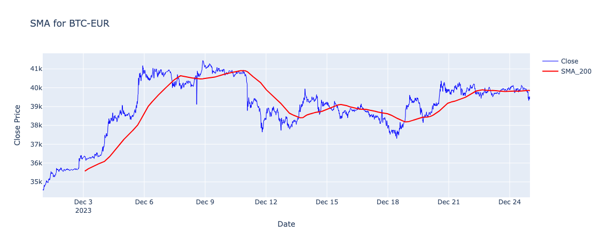
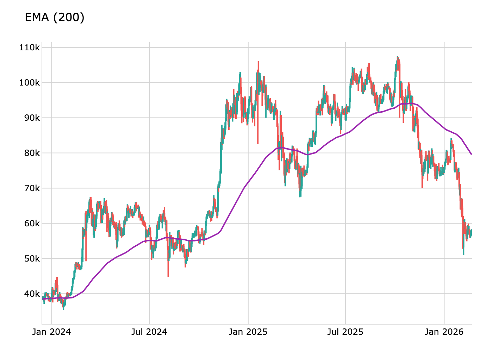

# PyIndicators

PyIndicators is a powerful and user-friendly Python library for technical analysis indicators and metrics. Written entirely in Python, it requires no external dependencies, ensuring seamless integration and ease of use.

## Features

* Native Python implementation, no external dependencies needed except for Polars or Pandas
* Dataframe first approach, with support for both pandas dataframes and polars dataframes
* Trend indicators
  * [Simple Moving Average (SMA)](#simple-moving-average-sma)
  * [Exponential Moving Average (EMA)](#exponential-moving-average-ema)
* Momentum indicators

## Installation

PyIndicators can be installed using pip:

```bash
pip install pyindicators
```

## Indicators

### Trend Indicators

#### Simple Moving Average (SMA)

```python
from investing_algorithm_framework import CSVOHLCVMarketDataSource

from pyindicators import sma

# For this example the investing algorithm framework is used for dataframe creation,
csv_path = "./tests/test_data/OHLCV_BTC-EUR_BINANCE_15m_2023-12-01:00:00_2023-12-25:00:00.csv"
data_source = CSVOHLCVMarketDataSource(csv_file_path=csv_path)

pl_df = data_source.get_data()
pd_df = data_source.get_data(pandas=True)

# Calculate SMA for Polars DataFrame
pl_df = sma(pl_df, source_column="Close", period=200, result_column="SMA_200")
pl_df.show(10)

# Calculate SMA for Pandas DataFrame
pd_df = sma(pd_df, source_column="Close", period=200, result_column="SMA_200")
pd_df.tail(10)
```



#### Exponential Moving Average (EMA)

```python
from investing_algorithm_framework import CSVOHLCVMarketDataSource

from pyindicators import ema

# For this example the investing algorithm framework is used for dataframe creation,
csv_path = "./tests/test_data/OHLCV_BTC-EUR_BINANCE_15m_2023-12-01:00:00_2023-12-25:00:00.csv"
data_source = CSVOHLCVMarketDataSource(csv_file_path=csv_path)

pl_df = data_source.get_data()
pd_df = data_source.get_data(pandas=True)

# Calculate SMA for Polars DataFrame
pl_df = ema(pl_df, source_column="Close", period=200, result_column="EMA_200")
pl_df.show(10)

# Calculate SMA for Pandas DataFrame
pd_df = ema(pd_df, source_column="Close", period=200, result_column="EMA_200")
pd_df.tail(10)
```



### Momentum Indicators

#### Relative Strength Index (RSI)

```python
from polars import DataFrame as plDataFrame
from pandas import DataFrame as pdDataFrame

from pyindicators import rsi

# Polars DataFrame
pl_df = plDataFrame({"close": [1, 2, 3, 4, 5, 6, 7, 8, 9, 10]})
# Pandas DataFrame
pd_df = pdDataFrame({"close": [1, 2, 3, 4, 5, 6, 7, 8, 9, 10]})

# Calculate RSI for Polars DataFrame
pl_df = rsi(pl_df, "close", 14)
pl_df.show(10)

# Calculate RSI for Pandas DataFrame
pd_df = rsi(pd_df, "close", 14)
print(pd_df)
```

### Indicator helpers

#### Is Crossover

```python
from polars import DataFrame as plDataFrame
from pandas import DataFrame as pdDataFrame

from pyindicators import is_crossover

# Polars DataFrame
pl_df = plDataFrame({
    "EMA_50": [200, 201, 202, 203, 204, 205, 206, 208, 208, 210],
    "EMA_200": [200, 201, 202, 203, 204, 205, 206, 207, 209, 209],
    "DateTime": pd.date_range("2021-01-01", periods=10, freq="D")
})
# Pandas DataFrame
pd_df = pdDataFrame({
    "EMA_50": [200, 201, 202, 203, 204, 205, 206, 208, 208, 210],
    "EMA_200": [200, 201, 202, 203, 204, 205, 206, 207, 209, 209],
    "DateTime": pd.date_range("2021-01-01", periods=10, freq="D")
})

if is_crossover(
    pl_df, first_column="EMA_50", second_column="EMA_200", data_points=3
):
    print("Crossover detected in Polars DataFrame")


if is_crossover(
    pd_df, first_column="EMA_50", second_column="EMA_200", data_points=3
):
    print("Crossover detected in Pandas DataFrame")
```
