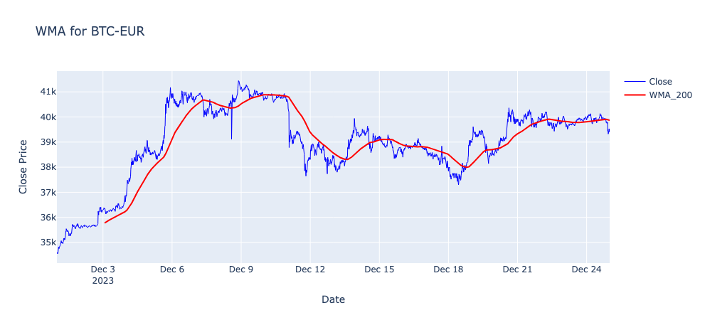
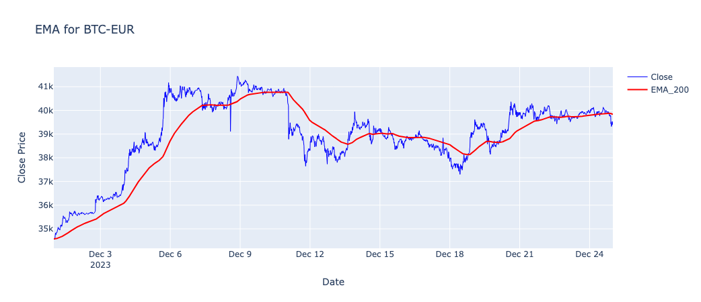
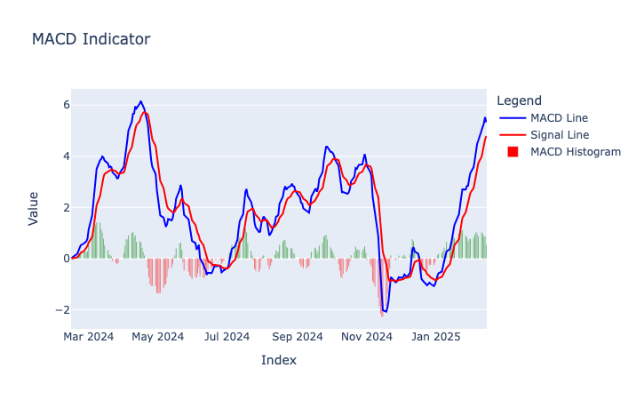
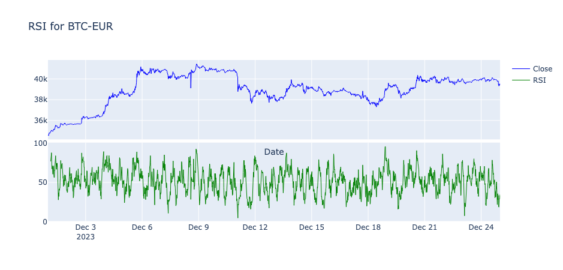
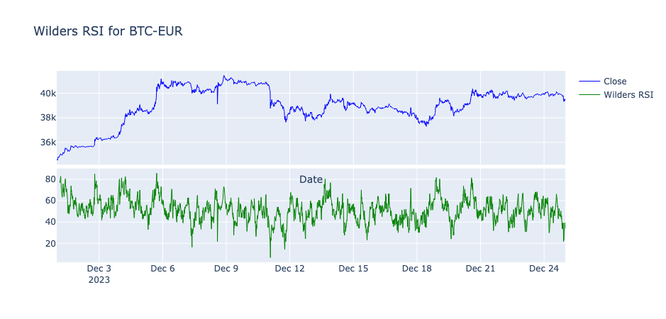
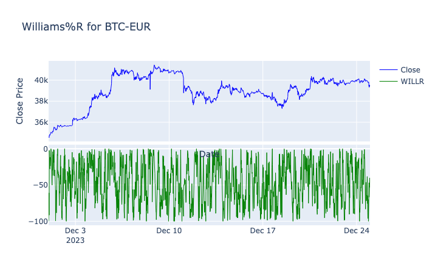
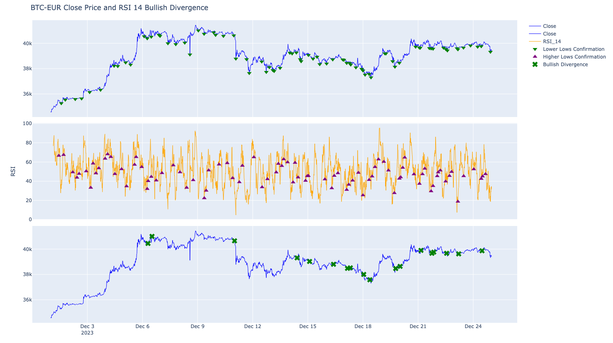
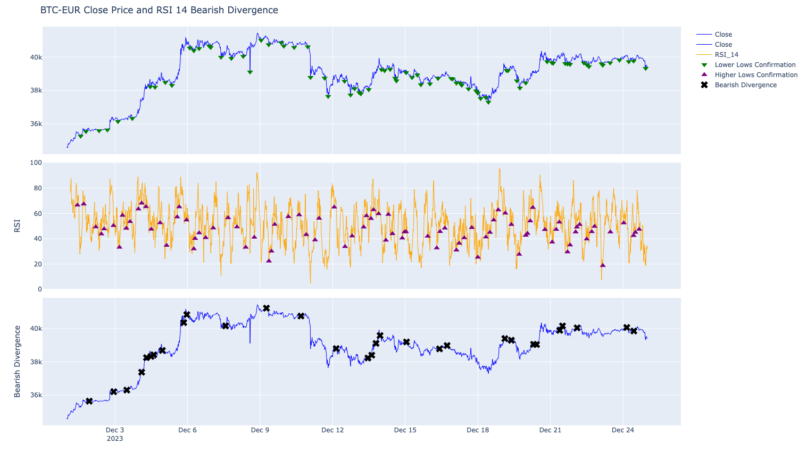
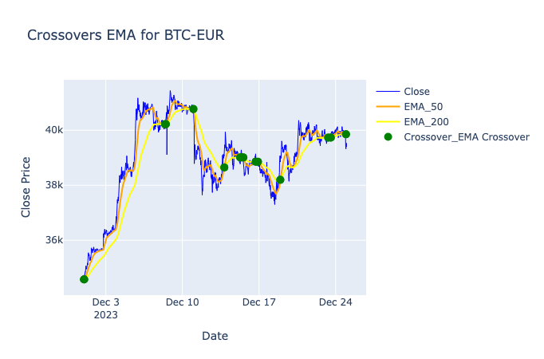
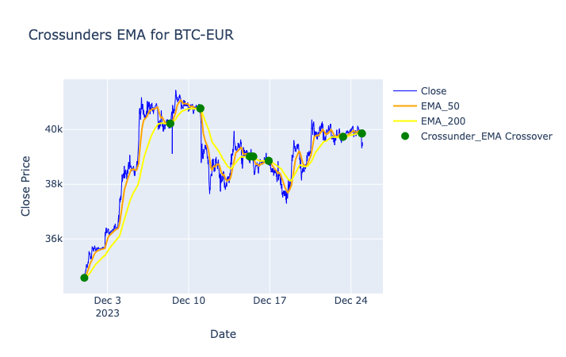

# PyIndicators

PyIndicators is a powerful and user-friendly Python library for financial technical analysis indicators, metrics and helper functions. Written entirely in Python, it requires no external dependencies, ensuring seamless integration and ease of use.

## Marketplace

We support [Finterion](https://www.finterion.com/) as our go-to marketplace for quantitative trading and trading bots.

<a href="https://www.finterion.com/" target="_blank">
    <picture style="height: 30px;">
    <source media="(prefers-color-scheme: dark)" srcset="static/sponsors/finterion-dark.png">
    <source media="(prefers-color-scheme: light)" srcset="static/sponsors/finterion-light.png">
    
    </picture>
</a>

## Works with the Investing Algorithm Framework

PyIndicators works natively with the [Investing Algorithm Framework](https://github.com/coding-kitties/investing-algorithm-framework) for creating trading bots. All indicators accept the DataFrame format returned by the framework, so you can go from market data to trading signals without any conversion or glue code.

```python
from investing_algorithm_framework import download
from pyindicators import ema, rsi, supertrend

# Download data directly into a DataFrame
df = download(
    symbol="btc/eur",
    market="binance",
    time_frame="1d",
    start_date="2024-01-01",
    end_date="2024-06-01",
    pandas=True,
    save=True,
    storage_path="./data"
)

# Apply indicators — no conversion needed
df = ema(df, source_column="Close", period=200)
df = rsi(df, source_column="Close")
df = supertrend(df, atr_length=10, factor=3.0)
```

## Installation

PyIndicators can be installed using pip:

```bash
pip install pyindicators
```

## Features

* Native Python implementation, no external dependencies needed except for Polars or Pandas
* Dataframe first approach, with support for both pandas dataframes and polars dataframes
* Supports python version 3.10 and above.
* [Trend indicators](#trend-indicators)
  * [Weighted Moving Average (WMA)](#weighted-moving-average-wma)
  * [Simple Moving Average (SMA)](#simple-moving-average-sma)
  * [Exponential Moving Average (EMA)](#exponential-moving-average-ema)
  * [Zero-Lag EMA Envelope (ZLEMA)](#zero-lag-ema-envelope-zlema)
  * [EMA Trend Ribbon](#ema-trend-ribbon)
  * [SuperTrend](#supertrend)
  * [SuperTrend Clustering](#supertrend-clustering)
  * [Pulse Mean Accelerator (PMA)](#pulse-mean-accelerator-pma)
  * [Volume Weighted Trend (VWT)](#volume-weighted-trend-vwt)
* [Momentum and Oscillators](#momentum-and-oscillators)
  * [Moving Average Convergence Divergence (MACD)](#moving-average-convergence-divergence-macd)
  * [Relative Strength Index (RSI)](#relative-strength-index-rsi)
  * [Relative Strength Index Wilders method (Wilders RSI)](#wilders-relative-strength-index-wilders-rsi)
  * [Williams %R](#williams-r)
  * [Average Directional Index (ADX)](#average-directional-index-adx)
  * [Stochastic Oscillator (STO)](#stochastic-oscillator-sto)
  * [Momentum Confluence](#momentum-confluence)
* [Volatility indicators](#volatility-indicators)
  * [Bollinger Bands (BB)](#bollinger-bands-bb)
  * [Bollinger Bands Overshoot](#bollinger-bands-overshoot)
  * [Average True Range (ATR)](#average-true-range-atr)
  * [Moving Average Envelope (MAE)](#moving-average-envelope-mae)
  * [Nadaraya-Watson Envelope (NWE)](#nadaraya-watson-envelope-nwe)
* [Support and Resistance](#support-and-resistance)
  * [Fibonacci Retracement](#fibonacci-retracement)
  * [Golden Zone](#golden-zone)
  * [Golden Zone Signal](#golden-zone-signal)
  * [Fair Value Gap (FVG)](#fair-value-gap-fvg)
  * [Order Blocks](#order-blocks)
  * [Breaker Blocks](#breaker-blocks)
  * [Mitigation Blocks](#mitigation-blocks)
  * [Rejection Blocks](#rejection-blocks)
  * [Optimal Trade Entry (OTE)](#optimal-trade-entry-ote)
  * [Market Structure Break](#market-structure-break)
  * [Market Structure CHoCH/BOS](#market-structure-chochbos)
  * [Liquidity Sweeps](#liquidity-sweeps)
  * [Buyside & Sellside Liquidity](#buyside--sellside-liquidity)
  * [Pure Price Action Liquidity Sweeps](#pure-price-action-liquidity-sweeps)
  * [Liquidity Pools](#liquidity-pools)
  * [Liquidity Levels / Voids (VP)](#liquidity-levels--voids-vp)
  * [Internal & External Liquidity Zones](#internal--external-liquidity-zones)
  * [Premium / Discount Zones](#premium--discount-zones)
  * [Trendline Breakout Navigator](#trendline-breakout-navigator)
* [Pattern recognition](#pattern-recognition)
  * [Detect Peaks](#detect-peaks)
  * [Detect Bullish Divergence](#detect-bullish-divergence)
  * [Detect Bearish Divergence](#detect-bearish-divergence)
* [Indicator helpers](#indicator-helpers)
  * [Crossover](#crossover)
  * [Is Crossover](#is-crossover)
  * [Crossunder](#crossunder)
  * [Is Crossunder](#is-crossunder)
  * [Is Downtrend](#is-downtrend)
  * [Is Uptrend](#is-uptrend)
  * [has_any_lower_then_threshold](#has_any_lower_then_threshold)

## Indicators

### Trend Indicators

Indicators that help to determine the direction of the market (uptrend, downtrend, or sideways) and confirm if a trend is in place.

#### Weighted Moving Average (WMA)

A Weighted Moving Average (WMA) is a type of moving average that assigns greater importance to recent data points compared to older ones. This makes it more responsive to recent price changes compared to a Simple Moving Average (SMA), which treats all data points equally. The WMA does this by using linear weighting, where the most recent prices get the highest weight, and weights decrease linearly for older data points.

```python
def wma(
    data: Union[PandasDataFrame, PolarsDataFrame],
    source_column: str,
    period: int,
    result_column: Optional[str] = None
) -> Union[PandasDataFrame, PolarsDataFrame]:
```

Example

```python
from investing_algorithm_framework import download

from pyindicators import wma

pl_df = download(
    symbol="btc/eur",
    market="binance",
    time_frame="1d",
    start_date="2023-12-01",
    end_date="2023-12-25",
    save=True,
    storage_path="./data"
)
pd_df = download(
    symbol="btc/eur",
    market="binance",
    time_frame="1d",
    start_date="2023-12-01",
    end_date="2023-12-25",
    pandas=True,
    save=True,
    storage_path="./data"
)

# Calculate SMA for Polars DataFrame
pl_df = wma(pl_df, source_column="Close", period=200, result_column="WMA_200")
pl_df.show(10)

# Calculate SMA for Pandas DataFrame
pd_df = wma(pd_df, source_column="Close", period=200, result_column="WMA_200")
pd_df.tail(10)
```



#### Simple Moving Average (SMA)

A Simple Moving Average (SMA) is the average of the last N data points, recalculated as new data comes in. Unlike the Weighted Moving Average (WMA), SMA treats all values equally, giving them the same weight.

```python
def sma(
    data: Union[PdDataFrame, PlDataFrame],
    source_column: str,
    period: int,
    result_column: str = None,
) -> Union[PdDataFrame, PlDataFrame]:
```

Example

```python
from investing_algorithm_framework import download

from pyindicators import sma

pl_df = download(
    symbol="btc/eur",
    market="binance",
    time_frame="1d",
    start_date="2023-12-01",
    end_date="2023-12-25",
    save=True,
    storage_path="./data"
)
pd_df = download(
    symbol="btc/eur",
    market="binance",
    time_frame="1d",
    start_date="2023-12-01",
    end_date="2023-12-25",
    pandas=True,
    save=True,
    storage_path="./data"
)

# Calculate SMA for Polars DataFrame
pl_df = sma(pl_df, source_column="Close", period=200, result_column="SMA_200")
pl_df.show(10)

# Calculate SMA for Pandas DataFrame
pd_df = sma(pd_df, source_column="Close", period=200, result_column="SMA_200")
pd_df.tail(10)
```


#### Exponential Moving Average (EMA)

The Exponential Moving Average (EMA) is a type of moving average that gives more weight to recent prices, making it more responsive to price changes than a Simple Moving Average (SMA). It does this by using an exponential decay where the most recent prices get exponentially more weight.

```python
def ema(
    data: Union[PdDataFrame, PlDataFrame],
    source_column: str,
    period: int,
    result_column: str = None,
) -> Union[PdDataFrame, PlDataFrame]:
```

Example

```python
from investing_algorithm_framework import download

from pyindicators import ema

pl_df = download(
    symbol="btc/eur",
    market="binance",
    time_frame="1d",
    start_date="2023-12-01",
    end_date="2023-12-25",
    save=True,
    storage_path="./data"
)
pd_df = download(
    symbol="btc/eur",
    market="binance",
    time_frame="1d",
    start_date="2023-12-01",
    end_date="2023-12-25",
    pandas=True,
    save=True,
    storage_path="./data"
)

# Calculate EMA for Polars DataFrame
pl_df = ema(pl_df, source_column="Close", period=200, result_column="EMA_200")
pl_df.show(10)

# Calculate EMA for Pandas DataFrame
pd_df = ema(pd_df, source_column="Close", period=200, result_column="EMA_200")
pd_df.tail(10)
```



#### Zero-Lag EMA Envelope (ZLEMA)

The Zero-Lag EMA Envelope combines a Zero-Lag Exponential Moving Average (ZLEMA) with ATR-based bands and multi-bar swing confirmation. The ZLEMA compensates for the inherent lag of a standard EMA by using a lag-compensated source (`close + (close - close[lag])`). Trend state is confirmed when multiple consecutive bars close beyond a band while the ZLEMA slope agrees.

Calculation:
- `lag = floor((length - 1) / 2)`
- `compensated = close + (close - close[lag])`
- `ZLEMA = EMA(compensated, length)`
- `Upper = ZLEMA + ATR × mult`
- `Lower = ZLEMA - ATR × mult`
- Bull: close > Upper for N bars AND ZLEMA rising
- Bear: close < Lower for N bars AND ZLEMA falling

```python
def zero_lag_ema_envelope(
    data: Union[PdDataFrame, PlDataFrame],
    source_column: str = 'Close',
    length: int = 200,
    mult: float = 2.0,
    atr_length: int = 21,
    confirm_bars: int = 2,
    upper_column: str = 'zlema_upper',
    lower_column: str = 'zlema_lower',
    middle_column: str = 'zlema_middle',
    trend_column: str = 'zlema_trend',
    signal_column: str = 'zlema_signal',
) -> Union[PdDataFrame, PlDataFrame]:
```

Example

```python
from investing_algorithm_framework import download

from pyindicators import zero_lag_ema_envelope

pl_df = download(
    symbol="btc/eur",
    market="binance",
    time_frame="1d",
    start_date="2023-12-01",
    end_date="2023-12-25",
    save=True,
    storage_path="./data"
)
pd_df = download(
    symbol="btc/eur",
    market="binance",
    time_frame="1d",
    start_date="2023-12-01",
    end_date="2023-12-25",
    pandas=True,
    save=True,
    storage_path="./data"
)

# Calculate Zero-Lag EMA Envelope for Polars DataFrame
pl_df = zero_lag_ema_envelope(pl_df, source_column="Close", length=200, mult=2.0)
pl_df.show(10)

# Calculate Zero-Lag EMA Envelope for Pandas DataFrame
pd_df = zero_lag_ema_envelope(pd_df, source_column="Close", length=200, mult=2.0)
pd_df.tail(10)
```


#### EMA Trend Ribbon

The EMA Trend Ribbon uses 9 Exponential Moving Averages with increasing periods to visualise trend strength and direction. At each bar the slope of every EMA is checked over a smoothing window; when a threshold number of EMAs agree on direction (default 7 out of 9) the trend is classified as bullish or bearish.

Calculation:
- Compute 9 EMAs with periods [8, 14, 20, 26, 32, 38, 44, 50, 60]
- An EMA is "rising" when `EMA[t] >= EMA[t - smoothing_period]`
- `bullish_count` = number of rising EMAs
- `bearish_count` = number of falling EMAs
- Trend = 1 if `bullish_count >= threshold`, -1 if `bearish_count >= threshold`, else 0

```python
def ema_trend_ribbon(
    data: Union[PdDataFrame, PlDataFrame],
    source_column: str = 'Close',
    ema_lengths: Optional[List[int]] = None,  # default [8,14,20,26,32,38,44,50,60]
    smoothing_period: int = 2,
    threshold: int = 7,
    trend_column: str = 'ema_ribbon_trend',
    bullish_count_column: str = 'ema_ribbon_bullish_count',
    bearish_count_column: str = 'ema_ribbon_bearish_count',
    ema_column_prefix: str = 'ema_ribbon',
) -> Union[PdDataFrame, PlDataFrame]:
```

Example

```python
from investing_algorithm_framework import download

from pyindicators import ema_trend_ribbon

pl_df = download(
    symbol="btc/eur",
    market="binance",
    time_frame="1d",
    start_date="2023-12-01",
    end_date="2023-12-25",
    save=True,
    storage_path="./data"
)
pd_df = download(
    symbol="btc/eur",
    market="binance",
    time_frame="1d",
    start_date="2023-12-01",
    end_date="2023-12-25",
    pandas=True,
    save=True,
    storage_path="./data"
)

# Calculate EMA Trend Ribbon for Polars DataFrame
pl_df = ema_trend_ribbon(pl_df, source_column="Close")
pl_df.show(10)

# Calculate EMA Trend Ribbon for Pandas DataFrame
pd_df = ema_trend_ribbon(pd_df, source_column="Close")
pd_df.tail(10)
```


#### SuperTrend

The SuperTrend indicator uses a fixed ATR multiplier factor to create a trend-following trailing stop. When the price is above the SuperTrend line the trend is bullish; when below, bearish. Trend changes generate buy/sell signals.

```python
def supertrend(
    data: Union[PdDataFrame, PlDataFrame],
    atr_length: int = 10,
    factor: float = 3.0
) -> Union[PdDataFrame, PlDataFrame]:
```

Returns the following columns:
- `supertrend`: The SuperTrend trailing stop value
- `supertrend_trend`: Current trend (1=bullish, 0=bearish)
- `supertrend_upper`: Upper band
- `supertrend_lower`: Lower band
- `supertrend_signal`: 1=buy signal, -1=sell signal, 0=no signal

Example

```python
from investing_algorithm_framework import download

from pyindicators import supertrend

pd_df = download(
    symbol="btc/eur",
    market="binance",
    time_frame="1d",
    start_date="2023-12-01",
    end_date="2023-12-25",
    pandas=True,
    save=True,
    storage_path="./data"
)

# Calculate SuperTrend
pd_df = supertrend(pd_df, atr_length=10, factor=3.0)
pd_df.tail(10)
```


#### SuperTrend Clustering

The SuperTrend Clustering indicator uses K-means clustering to optimize the ATR multiplier factor for the SuperTrend calculation. It computes multiple SuperTrend variations with different factors, evaluates their performance, and clusters them into "best", "average", and "worst" groups. The best-performing factor is then used to generate an adaptive trailing stop with buy/sell signals.

```python
def supertrend_clustering(
    data: Union[PdDataFrame, PlDataFrame],
    atr_length: int = 10,
    min_mult: float = 1.0,
    max_mult: float = 5.0,
    step: float = 0.5,
    perf_alpha: float = 10.0,
    from_cluster: str = 'best',
    max_iter: int = 1000,
    max_data: int = 10000
) -> Union[PdDataFrame, PlDataFrame]:
```

Returns the following columns:
- `supertrend`: The optimized SuperTrend trailing stop
- `supertrend_trend`: Current trend (1=bullish, 0=bearish)
- `supertrend_ama`: Adaptive moving average of SuperTrend
- `supertrend_perf_idx`: Performance index (0–1 scale)
- `supertrend_factor`: Currently used ATR factor
- `supertrend_signal`: 1=buy signal, -1=sell signal, 0=no signal

Example

```python
from investing_algorithm_framework import download

from pyindicators import supertrend_clustering, get_supertrend_stats

pd_df = download(
    symbol="btc/eur",
    market="binance",
    time_frame="1d",
    start_date="2023-12-01",
    end_date="2023-12-25",
    pandas=True,
    save=True,
    storage_path="./data"
)

# Calculate SuperTrend Clustering
pd_df = supertrend_clustering(
    pd_df,
    atr_length=14,
    min_mult=2.0,
    max_mult=6.0,
    step=0.5,
    perf_alpha=14.0,
    from_cluster='best',
    max_data=500
)

# Get statistics
stats = get_supertrend_stats(pd_df)
print(stats)
pd_df.tail(10)
```


#### Pulse Mean Accelerator (PMA)

The Pulse Mean Accelerator is a trend-following overlay indicator
translated from the Pine Script® by MisinkoMaster.  It adds a
volatility- and momentum-scaled acceleration offset to a base moving
average.  The acceleration accumulates over a configurable lookback:
bars where source momentum exceeds MA momentum push the PMA further
from the MA, while bars where the MA leads source momentum pull it
back.  Multiple MA types (RMA, SMA, EMA, WMA, DEMA, TEMA, HMA),
volatility measures (ATR, Standard Deviation, MAD), and smoothing
modes are supported.

**Parameters:**

| Parameter | Type | Default | Description |
|---|---|---|---|
| `source_column` | str | `"Close"` | Source price column |
| `ma_type` | str | `"RMA"` | MA type: RMA, SMA, EMA, WMA, DEMA, TEMA, HMA |
| `ma_length` | int | `20` | Lookback for the base moving average |
| `accel_lookback` | int | `32` | Bars over which acceleration is accumulated |
| `max_accel` | float | `0.2` | Maximum absolute acceleration factor |
| `volatility_type` | str | `"Standard Deviation"` | Volatility: ATR, Standard Deviation, MAD |
| `smooth_type` | str | `"Double Moving Average"` | Smoothing: NONE, Exponential, Extra Moving Average, Double Moving Average |
| `use_confirmation` | bool | `True` | Require combined PMA+MA momentum to confirm trend flips |

**Output columns:** `pma`, `pma_ma`, `pma_trend`, `pma_long`, `pma_short`, `pma_acceleration`

```python
import pandas as pd
from pyindicators import (
    pulse_mean_accelerator,
    pulse_mean_accelerator_signal,
    get_pulse_mean_accelerator_stats,
)

# --- With pandas ---
df = pd.read_csv("data.csv")
df = pulse_mean_accelerator(
    df,
    ma_type="RMA",
    ma_length=20,
    accel_lookback=32,
    max_accel=0.2,
    volatility_type="Standard Deviation",
    smooth_type="Double Moving Average",
    use_confirmation=True,
)
df = pulse_mean_accelerator_signal(df)
stats = get_pulse_mean_accelerator_stats(df)
print(stats)
df[["Close", "pma", "pma_ma", "pma_trend", "pma_long", "pma_short"]].tail(10)
```


#### Volume Weighted Trend (VWT)

The Volume Weighted Trend indicator uses a Volume Weighted Moving Average (VWMA) with ATR-based volatility bands to determine trend direction. Based on the "Volume Weighted Trend [QuantAlgo]" concept. The VWMA serves as the trend baseline, while upper and lower bands (VWMA +/- ATR * multiplier) define breakout thresholds. The trend flips bullish when price closes above the upper band and bearish when price closes below the lower band.

```python
def volume_weighted_trend(
    df: Union[PdDataFrame, PlDataFrame],
    vwma_length: int = 34,
    atr_multiplier: float = 1.5,
    high_column: str = "High",
    low_column: str = "Low",
    close_column: str = "Close",
    volume_column: str = "Volume",
) -> Union[PdDataFrame, PlDataFrame]:
```

Returns the following columns:
- `vwt_vwma`: Volume Weighted Moving Average
- `vwt_atr`: Average True Range
- `vwt_upper`: Upper volatility band (VWMA + ATR * multiplier)
- `vwt_lower`: Lower volatility band (VWMA - ATR * multiplier)
- `vwt_trend`: Trend direction (+1 bullish, -1 bearish, 0 undefined)
- `vwt_trend_changed`: 1 on bars where trend flipped, 0 otherwise
- `vwt_signal`: +1 on bullish flip, -1 on bearish flip, 0 otherwise

Example

```python
from investing_algorithm_framework import download

from pyindicators import volume_weighted_trend, get_volume_weighted_trend_stats

pd_df = download(
    symbol="btc/eur",
    market="bitvavo",
    time_frame="4h",
    start_date="2024-01-01",
    end_date="2024-04-01",
    pandas=True,
)

# Calculate Volume Weighted Trend
pd_df = volume_weighted_trend(pd_df, vwma_length=34, atr_multiplier=1.5)

# Get summary statistics
stats = get_volume_weighted_trend_stats(pd_df)
print(stats)

pd_df[["Close", "vwt_vwma", "vwt_upper", "vwt_lower", "vwt_trend", "vwt_signal"]].tail(10)
```


### Momentum and Oscillators

Indicators that measure the strength and speed of price movements rather than the direction.

#### Moving Average Convergence Divergence (MACD)

The Moving Average Convergence Divergence (MACD) is used to identify trend direction, strength, and potential reversals. It is based on the relationship between two Exponential Moving Averages (EMAs) and includes a histogram to visualize momentum.

```python
def macd(
    data: Union[PdDataFrame, PlDataFrame],
    source_column: str,
    short_period: int = 12,
    long_period: int = 26,
    signal_period: int = 9,
    macd_column: str = "macd",
    signal_column: str = "macd_signal",
    histogram_column: str = "macd_histogram"
) -> Union[PdDataFrame, PlDataFrame]:
```

Example

```python
from investing_algorithm_framework import download

from pyindicators import macd

pl_df = download(
    symbol="btc/eur",
    market="binance",
    time_frame="1d",
    start_date="2023-12-01",
    end_date="2023-12-25",
    save=True,
    storage_path="./data"
)
pd_df = download(
    symbol="btc/eur",
    market="binance",
    time_frame="1d",
    start_date="2023-12-01",
    end_date="2023-12-25",
    pandas=True,
    save=True,
    storage_path="./data"
)

# Calculate MACD for Polars DataFrame
pl_df = macd(pl_df, source_column="Close", short_period=12, long_period=26, signal_period=9)

# Calculate MACD for Pandas DataFrame
pd_df = macd(pd_df, source_column="Close", short_period=12, long_period=26, signal_period=9)

pl_df.show(10)
pd_df.tail(10)
```



#### Relative Strength Index (RSI)

The Relative Strength Index (RSI) is a momentum oscillator that measures the speed and change of price movements. It moves between 0 and 100 and is used to identify overbought or oversold conditions in a market.

```python
def rsi(
    data: Union[pd.DataFrame, pl.DataFrame],
    source_column: str,
    period: int = 14,
    result_column: str = None,
) -> Union[pd.DataFrame, pl.DataFrame]:
```

Example

```python
from investing_algorithm_framework import download

from pyindicators import rsi

pl_df = download(
    symbol="btc/eur",
    market="binance",
    time_frame="1d",
    start_date="2023-12-01",
    end_date="2023-12-25",
    save=True,
    storage_path="./data"
)
pd_df = download(
    symbol="btc/eur",
    market="binance",
    time_frame="1d",
    start_date="2023-12-01",
    end_date="2023-12-25",
    pandas=True,
    save=True,
    storage_path="./data"
)

# Calculate RSI for Polars DataFrame
pl_df = rsi(pl_df, source_column="Close", period=14, result_column="RSI_14")
pl_df.show(10)

# Calculate RSI for Pandas DataFrame
pd_df = rsi(pd_df, source_column="Close", period=14, result_column="RSI_14")
pd_df.tail(10)
```



#### Wilders Relative Strength Index (Wilders RSI)

The Wilders Relative Strength Index (RSI) is a momentum oscillator that measures the speed and change of price movements. It moves between 0 and 100 and is used to identify overbought or oversold conditions in a market. The Wilders RSI uses a different calculation method than the standard RSI.

```python
def wilders_rsi(
    data: Union[pd.DataFrame, pl.DataFrame],
    source_column: str,
    period: int = 14,
    result_column: str = None,
) -> Union[pd.DataFrame, pl.DataFrame]:
```

Example

```python
from investing_algorithm_framework import download

from pyindicators import wilders_rsi

pl_df = download(
    symbol="btc/eur",
    market="binance",
    time_frame="1d",
    start_date="2023-12-01",
    end_date="2023-12-25",
    save=True,
    storage_path="./data"
)
pd_df = download(
    symbol="btc/eur",
    market="binance",
    time_frame="1d",
    start_date="2023-12-01",
    end_date="2023-12-25",
    pandas=True,
    save=True,
    storage_path="./data"
)

# Calculate Wilders RSI for Polars DataFrame
pl_df = wilders_rsi(pl_df, source_column="Close", period=14, result_column="RSI_14")
pl_df.show(10)

# Calculate Wilders RSI for Pandas DataFrame
pd_df = wilders_rsi(pd_df, source_column="Close", period=14, result_column="RSI_14")
pd_df.tail(10)
```



#### Williams %R

Williams %R (Williams Percent Range) is a momentum indicator used in technical analysis to measure overbought and oversold conditions in a market. It moves between 0 and -100 and helps traders identify potential reversal points.

```python
def willr(
    data: Union[pd.DataFrame, pl.DataFrame],
    period: int = 14,
    result_column: str = None,
    high_column: str = "High",
    low_column: str = "Low",
    close_column: str = "Close"
) -> Union[pd.DataFrame, pl.DataFrame]:
```

Example

```python
from investing_algorithm_framework import download

from pyindicators import willr

pl_df = download(
    symbol="btc/eur",
    market="binance",
    time_frame="1d",
    start_date="2023-12-01",
    end_date="2023-12-25",
    save=True,
    storage_path="./data"
)
pd_df = download(
    symbol="btc/eur",
    market="binance",
    time_frame="1d",
    start_date="2023-12-01",
    end_date="2023-12-25",
    pandas=True,
    save=True,
    storage_path="./data"
)

pl_df = data_source.get_data()
pd_df = data_source.get_data(pandas=True)

# Calculate Williams%R for Polars DataFrame
pl_df = willr(pl_df, result_column="WILLR")
pl_df.show(10)

# Calculate Williams%R for Pandas DataFrame
pd_df = willr(pd_df, result_column="WILLR")
pd_df.tail(10)
```



#### Average Directional Index (ADX)

The Average Directional Index (ADX) is a trend strength indicator that helps traders identify the strength of a trend, regardless of its direction. It is derived from the Positive Directional Indicator (+DI) and Negative Directional Indicator (-DI) and moves between 0 and 100.

```python
def adx(
    data: Union[PdDataFrame, PlDataFrame],
    period=14,
    adx_result_column="ADX",
    di_plus_result_column="+DI",
    di_minus_result_column="-DI",
) -> Union[PdDataFrame, PlDataFrame]:
```

Example

```python
from investing_algorithm_framework import download

from pyindicators import adx

pl_df = download(
    symbol="btc/eur",
    market="binance",
    time_frame="1d",
    start_date="2023-12-01",
    end_date="2023-12-25",
    save=True,
    storage_path="./data"
)
pd_df = download(
    symbol="btc/eur",
    market="binance",
    time_frame="1d",
    start_date="2023-12-01",
    end_date="2023-12-25",
    pandas=True,
    save=True,
    storage_path="./data"
)

# Calculate ADX for Polars DataFrame
pl_df = adx(pl_df)
pl_df.show(10)

# Calculate ADX for Pandas DataFrame
pd_df = adx(pd_df)
pd_df.tail(10)
```


#### Stochastic Oscillator (STO)
The Stochastic Oscillator (STO) is a momentum indicator that compares a particular closing price of an asset to a range of its prices over a certain period. It is used to identify overbought or oversold conditions in a market. The STO consists of two lines: %K and %D, where %K is the main line and %D is the signal line.

```python
def stochastic_oscillator(
    data: Union[pd.DataFrame, pl.DataFrame],
    high_column: str = "High",
    low_column: str = "Low",
    close_column: str = "Close",
    k_period: int = 14,
    k_slowing: int = 3,
    d_period: int = 3,
    result_column: Optional[str] = None
) -> Union[pd.DataFrame, pl.DataFrame]:
```

Example

```python
from investing_algorithm_framework import download
from pyindicators import stochastic_oscillator
pl_df = download(
    symbol="btc/eur",
    market="binance",
    time_frame="1d",
    start_date="2023-12-01",
    end_date="2023-12-25",
    save=True,
    storage_path="./data"
)
pd_df = download(
    symbol="btc/eur",
    market="binance",
    time_frame="1d",
    start_date="2023-12-01",
    end_date="2023-12-25",
    pandas=True,
    save=True,
    storage_path="./data"
)
# Calculate Stochastic Oscillator for Polars DataFrame
pl_df = stochastic_oscillator(pl_df, high_column="High", low_column="Low", close_column="Close", k_period=14, k_slowing=3, d_period=3, result_column="STO")
pl_df.show(10)
# Calculate Stochastic Oscillator for Pandas DataFrame
pd_df = stochastic_oscillator(pd_df, high_column="High", low_column="Low", close_column="Close", k_period=14, k_slowing=3, d_period=3, result_column="STO")
pd_df.tail(10)
```


#### Momentum Confluence

Momentum Confluence is a comprehensive multi-component oscillator that combines multiple technical analysis components to provide a powerful trend following and reversal detection system.

**Components:**
1. **Money Flow**: Measures buying/selling liquidity entering the market (-100 to +100)
2. **Thresholds**: Dynamic levels showing significant buying/selling activity
3. **Overflow**: Detects excess buying/selling that predicts reversals
4. **Trend Wave**: A highly reactive trend-following oscillator (0-100)
5. **Real-Time Divergences**: Price vs oscillator divergence detection
6. **Reversal Signals**: High-frequency (small dots) and strong (arrows) reversal signals
7. **Confluence**: Combined signal strength from all components (-100 to +100)

```python
def momentum_confluence(
    data: Union[PdDataFrame, PlDataFrame],
    money_flow_length: int = 14,
    trend_wave_length: int = 10,
    threshold_mult: float = 1.5,
    overflow_threshold: float = 0.8,
    divergence_lookback: int = 5,
    high_column: str = 'High',
    low_column: str = 'Low',
    close_column: str = 'Close',
    volume_column: str = 'Volume',
    ...
) -> Union[PdDataFrame, PlDataFrame]:
```

Example

```python
from pyindicators import (
    momentum_confluence,
    momentum_confluence_signal,
    get_momentum_confluence_stats
)

# Calculate Momentum Confluence
df = momentum_confluence(df)

# Generate trading signals
df = momentum_confluence_signal(df)

# Get statistics
stats = get_momentum_confluence_stats(df)
print(f"Strong bullish reversals: {stats['strong_reversal_bullish_count']}")
print(f"Divergences detected: {stats['divergence_bullish_count']}")
```

**Output Columns:**
- `money_flow`: Money flow oscillator (-100 to +100)
- `mf_upper_threshold` / `mf_lower_threshold`: Dynamic threshold levels
- `overflow_bullish` / `overflow_bearish`: Excess buying/selling (0 or 1)
- `trend_wave`: Trend oscillator (0-100)
- `trend_wave_signal`: Trend direction (1=bullish, -1=bearish, 0=neutral)
- `divergence_bullish` / `divergence_bearish`: Divergence detection (0 or 1)
- `reversal_bullish` / `reversal_bearish`: High-frequency reversal signals (0 or 1)
- `reversal_strong_bullish` / `reversal_strong_bearish`: Strong reversal signals (0 or 1)
- `confluence`: Combined signal strength (-100 to +100)
- `mc_trend`: Overall trend direction (1=bullish, -1=bearish, 0=neutral)

**Signal Values (from momentum_confluence_signal):**
- `2`: Strong bullish reversal signal
- `1`: Bullish confluence
- `0`: Neutral
- `-1`: Bearish confluence
- `-2`: Strong bearish reversal signal


### Volatility indicators

Indicators that measure the rate of price movement, regardless of direction. They help to identify
periods of high and low volatility in the market.

#### Bollinger Bands (BB)

Bollinger Bands are a volatility indicator that consists of a middle band (SMA) and two outer bands (standard deviations). They help traders identify overbought and oversold conditions.

```python
def bollinger_bands(
    data: Union[PdDataFrame, PlDataFrame],
    source_column='Close',
    period=20,
    std_dev=2,
    middle_band_column_result_column='bollinger_middle',
    upper_band_column_result_column='bollinger_upper',
    lower_band_column_result_column='bollinger_lower'
) -> Union[PdDataFrame, PlDataFrame]:
```

Example

```python
from investing_algorithm_framework import download

from pyindicators import bollinger_bands

pl_df = download(
    symbol="btc/eur",
    market="binance",
    time_frame="1d",
    start_date="2023-12-01",
    end_date="2023-12-25",
    save=True,
    storage_path="./data"
)
pd_df = download(
    symbol="btc/eur",
    market="binance",
    time_frame="1d",
    start_date="2023-12-01",
    end_date="2023-12-25",
    pandas=True,
    save=True,
    storage_path="./data"
)

# Calculate bollinger bands for Polars DataFrame
pl_df = bollinger_bands(pl_df, source_column="Close")
pl_df.show(10)

# Calculate bollinger bands for Pandas DataFrame
pd_df = bollinger_bands(pd_df, source_column="Close")
pd_df.tail(10)
```


#### Bollinger Bands Overshoot

Bollinger Bands Overshoot measures how far the price has exceeded the upper or lower Bollinger Band, expressed as a percentage of the half-band width (distance from middle to upper/lower band). This indicator helps identify extreme price movements and potential mean reversion opportunities.

**Calculation:**
- When price > upper band (bullish overshoot): `((Price - Upper Band) / (Upper Band - Middle Band)) × 100`
- When price < lower band (bearish overshoot): `((Price - Lower Band) / (Middle Band - Lower Band)) × 100`
- When price is within bands: `0%`

**Interpretation:**
- Positive values indicate overbought conditions (price above upper band)
- Negative values indicate oversold conditions (price below lower band)
- High overshoots (e.g., 40%) indicate increased risk of mean reversion

```python
def bollinger_overshoot(
    data: Union[PdDataFrame, PlDataFrame],
    source_column='Close',
    period=20,
    std_dev=2,
    result_column='bollinger_overshoot'
) -> Union[PdDataFrame, PlDataFrame]:
```

Example

```python
from investing_algorithm_framework import download

from pyindicators import bollinger_overshoot

pl_df = download(
    symbol="btc/eur",
    market="binance",
    time_frame="1d",
    start_date="2023-12-01",
    end_date="2023-12-25",
    save=True,
    storage_path="./data"
)
pd_df = download(
    symbol="btc/eur",
    market="binance",
    time_frame="1d",
    start_date="2023-12-01",
    end_date="2023-12-25",
    pandas=True,
    save=True,
    storage_path="./data"
)

# Calculate Bollinger Bands Overshoot for Polars DataFrame
pl_df = bollinger_overshoot(pl_df, source_column="Close")
pl_df.show(10)

# Calculate Bollinger Bands Overshoot for Pandas DataFrame
pd_df = bollinger_overshoot(pd_df, source_column="Close")
pd_df.tail(10)
```


#### Average True Range (ATR)

The Average True Range (ATR) is a volatility indicator that measures the average range between the high and low prices over a specified period. It helps traders identify potential price fluctuations and adjust their strategies accordingly.

```python
def atr(
    data: Union[PdDataFrame, PlDataFrame],
    source_column="Close",
    period=14,
    result_column="ATR"
) -> Union[PdDataFrame, PlDataFrame]:
```

Example

```python
from investing_algorithm_framework import download

from pyindicators import atr

pl_df = download(
    symbol="btc/eur",
    market="binance",
    time_frame="1d",
    start_date="2023-12-01",
    end_date="2023-12-25",
    save=True,
    storage_path="./data"
)
pd_df = download(
    symbol="btc/eur",
    market="binance",
    time_frame="1d",
    start_date="2023-12-01",
    end_date="2023-12-25",
    pandas=True,
    save=True,
    storage_path="./data"
)

# Calculate average true range for Polars DataFrame
pl_df = atr(pl_df, source_column="Close")
pl_df.show(10)

# Calculate average true range for Pandas DataFrame
pd_df = atr(pd_df, source_column="Close")
pd_df.tail(10)
```


#### Moving Average Envelope (MAE)

Moving Average Envelopes are percentage-based envelopes set above and below a moving average. The moving average forms the base, and the envelopes are set at a fixed percentage above and below. This indicator is useful for identifying overbought/oversold conditions, spotting trend direction, and finding support and resistance levels.

```python
def moving_average_envelope(
    data: Union[PdDataFrame, PlDataFrame],
    source_column: str = 'Close',
    period: int = 20,
    percentage: float = 2.5,
    ma_type: str = 'sma',
    middle_column: str = 'ma_envelope_middle',
    upper_column: str = 'ma_envelope_upper',
    lower_column: str = 'ma_envelope_lower'
) -> Union[PdDataFrame, PlDataFrame]:
```

Example

```python
from investing_algorithm_framework import download

from pyindicators import moving_average_envelope

pl_df = download(
    symbol="btc/eur",
    market="binance",
    time_frame="1d",
    start_date="2023-12-01",
    end_date="2023-12-25",
    save=True,
    storage_path="./data"
)
pd_df = download(
    symbol="btc/eur",
    market="binance",
    time_frame="1d",
    start_date="2023-12-01",
    end_date="2023-12-25",
    pandas=True,
    save=True,
    storage_path="./data"
)

# Calculate Moving Average Envelope for Polars DataFrame
pl_df = moving_average_envelope(pl_df, source_column="Close", period=20, percentage=2.5)
pl_df.show(10)

# Calculate Moving Average Envelope for Pandas DataFrame
pd_df = moving_average_envelope(pd_df, source_column="Close", period=20, percentage=2.5)
pd_df.tail(10)
```


#### Nadaraya-Watson Envelope (NWE)

The Nadaraya-Watson Envelope uses Gaussian kernel regression to create a smoothed price estimate, then adds an envelope based on the mean absolute error (MAE) scaled by a multiplier. This is a non-repainting (endpoint) implementation. It is useful for identifying overbought/oversold zones and mean-reversion opportunities.

Calculation:
- Kernel weights: `w(i) = exp(-i² / (2 × h²))` for `i = 0..lookback-1`
- Smoothed value: `sum(src[t-i] × w(i)) / sum(w(i))`
- MAE: SMA of `|src - smoothed|` over the lookback period
- Upper: `smoothed + mult × MAE`
- Lower: `smoothed - mult × MAE`

```python
def nadaraya_watson_envelope(
    data: Union[PdDataFrame, PlDataFrame],
    source_column: str = 'Close',
    bandwidth: float = 8.0,
    mult: float = 3.0,
    lookback: int = 500,
    upper_column: str = 'nwe_upper',
    lower_column: str = 'nwe_lower',
    middle_column: str = 'nwe_middle',
) -> Union[PdDataFrame, PlDataFrame]:
```

Example

```python
from investing_algorithm_framework import download

from pyindicators import nadaraya_watson_envelope

pl_df = download(
    symbol="btc/eur",
    market="binance",
    time_frame="1d",
    start_date="2023-12-01",
    end_date="2023-12-25",
    save=True,
    storage_path="./data"
)
pd_df = download(
    symbol="btc/eur",
    market="binance",
    time_frame="1d",
    start_date="2023-12-01",
    end_date="2023-12-25",
    pandas=True,
    save=True,
    storage_path="./data"
)

# Calculate Nadaraya-Watson Envelope for Polars DataFrame
pl_df = nadaraya_watson_envelope(pl_df, source_column="Close", bandwidth=8.0, mult=3.0)
pl_df.show(10)

# Calculate Nadaraya-Watson Envelope for Pandas DataFrame
pd_df = nadaraya_watson_envelope(pd_df, source_column="Close", bandwidth=8.0, mult=3.0)
pd_df.tail(10)
```


### Support and Resistance

Indicators that help identify potential support and resistance levels in the market.

#### Fibonacci Retracement

Fibonacci retracement levels are horizontal lines that indicate where support and resistance are likely to occur. They are based on Fibonacci numbers and are drawn between a swing high and swing low. The standard levels are 0.0 (0%), 0.236 (23.6%), 0.382 (38.2%), 0.5 (50%), 0.618 (61.8% - Golden Ratio), 0.786 (78.6%), and 1.0 (100%).

The calculation formula is:
```
Level Price = Swing High - (Swing High - Swing Low) × Fibonacci Ratio
```

```python
def fibonacci_retracement(
    data: Union[PdDataFrame, PlDataFrame],
    high_column: str = 'High',
    low_column: str = 'Low',
    levels: Optional[List[float]] = None,
    lookback_period: Optional[int] = None,
    swing_high: Optional[float] = None,
    swing_low: Optional[float] = None,
    result_prefix: str = 'fib'
) -> Union[PdDataFrame, PlDataFrame]:
```

Example

```python
from investing_algorithm_framework import download

from pyindicators import fibonacci_retracement

pl_df = download(
    symbol="btc/eur",
    market="binance",
    time_frame="1d",
    start_date="2023-12-01",
    end_date="2023-12-25",
    save=True,
    storage_path="./data"
)
pd_df = download(
    symbol="btc/eur",
    market="binance",
    time_frame="1d",
    start_date="2023-12-01",
    end_date="2023-12-25",
    pandas=True,
    save=True,
    storage_path="./data"
)

# Calculate Fibonacci retracement for Polars DataFrame
pl_df = fibonacci_retracement(pl_df, high_column="High", low_column="Low")
pl_df.show(10)

# Calculate Fibonacci retracement for Pandas DataFrame
pd_df = fibonacci_retracement(pd_df, high_column="High", low_column="Low")
pd_df.tail(10)
```


#### Golden Zone

The Golden Zone indicator calculates Fibonacci retracement levels based on the highest high and lowest low over a specified rolling period. The "Golden Zone" refers to the area between the 50% and 61.8% Fibonacci retracement levels, which is often considered a key area for potential price reversals or continuations.

This indicator plots dynamic support/resistance levels that update with each bar, making it useful for identifying potential entry and exit points in trending markets.

The calculation formula is:
```
Highest High (HH) = Rolling maximum of high prices over `length` bars
Lowest Low (LL) = Rolling minimum of low prices over `length` bars
Diff = HH - LL
Upper Level = HH - (Diff × 0.5)      # 50% retracement
Lower Level = HH - (Diff × 0.618)    # 61.8% retracement
```

```python
def golden_zone(
    data: Union[PdDataFrame, PlDataFrame],
    high_column: str = 'High',
    low_column: str = 'Low',
    length: int = 60,
    retracement_level_1: float = 0.5,
    retracement_level_2: float = 0.618,
    upper_column: str = 'golden_zone_upper',
    lower_column: str = 'golden_zone_lower',
    hh_column: str = 'golden_zone_hh',
    ll_column: str = 'golden_zone_ll'
) -> Union[PdDataFrame, PlDataFrame]:
```

Example

```python
from investing_algorithm_framework import download

from pyindicators import golden_zone

pl_df = download(
    symbol="btc/eur",
    market="binance",
    time_frame="1d",
    start_date="2023-12-01",
    end_date="2023-12-25",
    save=True,
    storage_path="./data"
)
pd_df = download(
    symbol="btc/eur",
    market="binance",
    time_frame="1d",
    start_date="2023-12-01",
    end_date="2023-12-25",
    pandas=True,
    save=True,
    storage_path="./data"
)

# Calculate Golden Zone for Polars DataFrame
pl_df = golden_zone(pl_df, high_column="High", low_column="Low", length=60)
pl_df.show(10)

# Calculate Golden Zone for Pandas DataFrame
pd_df = golden_zone(pd_df, high_column="High", low_column="Low", length=60)
pd_df.tail(10)
```


#### Golden Zone Signal

The Golden Zone Signal function generates trading signals based on whether the price is within the Golden Zone. It returns a signal value of 1 when the close price is between the upper (50%) and lower (61.8%) boundaries of the Golden Zone, and 0 when the price is outside the zone.

This can be used to identify potential support/resistance areas and generate trading signals when price enters or exits the Golden Zone.

> !Important: This function requires the Golden Zone columns to be present in the DataFrame. You must call the `golden_zone()` function first before using `golden_zone_signal()`.

Signal values:
- **1**: Price is within the Golden Zone (potential support/resistance area)
- **0**: Price is outside the Golden Zone

```python
def golden_zone_signal(
    data: Union[PdDataFrame, PlDataFrame],
    close_column: str = 'Close',
    upper_column: str = 'golden_zone_upper',
    lower_column: str = 'golden_zone_lower',
    signal_column: str = 'golden_zone_signal'
) -> Union[PdDataFrame, PlDataFrame]:
```

Example

```python
from investing_algorithm_framework import download

from pyindicators import golden_zone, golden_zone_signal

pl_df = download(
    symbol="btc/eur",
    market="binance",
    time_frame="1d",
    start_date="2023-12-01",
    end_date="2023-12-25",
    save=True,
    storage_path="./data"
)
pd_df = download(
    symbol="btc/eur",
    market="binance",
    time_frame="1d",
    start_date="2023-12-01",
    end_date="2023-12-25",
    pandas=True,
    save=True,
    storage_path="./data"
)

# First calculate Golden Zone, then the signal for Polars DataFrame
pl_df = golden_zone(pl_df, high_column="High", low_column="Low", length=60)
pl_df = golden_zone_signal(pl_df)
pl_df.show(10)

# First calculate Golden Zone, then the signal for Pandas DataFrame
pd_df = golden_zone(pd_df, high_column="High", low_column="Low", length=60)
pd_df = golden_zone_signal(pd_df)
pd_df.tail(10)
```


#### Fair Value Gap (FVG)

A Fair Value Gap (FVG) is a price imbalance that occurs when there's a gap between candlesticks, representing institutional order flow. These gaps often act as support/resistance zones where price tends to return.

**Bullish FVG (Gap Up):** Occurs when the low of the current candle is higher than the high of the candle 2 bars ago. This creates an upward gap that may act as future support.

**Bearish FVG (Gap Down):** Occurs when the high of the current candle is lower than the low of the candle 2 bars ago. This creates a downward gap that may act as future resistance.

```python
def fair_value_gap(
    data: Union[PdDataFrame, PlDataFrame],
    high_column: str = 'High',
    low_column: str = 'Low',
    bullish_fvg_column: str = 'bullish_fvg',
    bearish_fvg_column: str = 'bearish_fvg',
    bullish_fvg_top_column: str = 'bullish_fvg_top',
    bullish_fvg_bottom_column: str = 'bullish_fvg_bottom',
    bearish_fvg_top_column: str = 'bearish_fvg_top',
    bearish_fvg_bottom_column: str = 'bearish_fvg_bottom'
) -> Union[PdDataFrame, PlDataFrame]:
```

Example

```python
import pandas as pd
from pyindicators import fair_value_gap, fvg_signal, fvg_filled

# Create sample OHLC data
df = pd.DataFrame({
    'High': [100, 105, 115, 120, 118, 115],
    'Low': [95, 100, 102, 115, 113, 99],
    'Close': [98, 103, 110, 117, 115, 100]
})

# Detect Fair Value Gaps
df = fair_value_gap(df)
print(df[['bullish_fvg', 'bearish_fvg', 'bullish_fvg_top', 'bullish_fvg_bottom']])

# Generate signals when price enters an FVG zone
df = fvg_signal(df)
print(df['fvg_signal'])  # 1 = in bullish zone, -1 = in bearish zone, 0 = outside

# Detect when FVGs have been filled (mitigated)
df = fvg_filled(df)
print(df[['bullish_fvg_filled', 'bearish_fvg_filled']])
```

The `fvg_signal` function generates signals:
- **1**: Price is within a bullish FVG zone (potential long entry)
- **-1**: Price is within a bearish FVG zone (potential short entry)
- **0**: Price is outside any FVG zone

The `fvg_filled` function detects when FVGs have been mitigated:
- Bullish FVG filled: Price drops to reach the bottom of the gap
- Bearish FVG filled: Price rises to reach the top of the gap


#### Order Blocks

Order Blocks are zones where institutional traders (banks, hedge funds) placed large orders, causing significant price moves. They represent areas of supply and demand imbalance that often act as support/resistance when price returns.

**Bullish Order Block:** The last bearish candle before a strong upward move. When price returns to this zone, it often bounces up (support).

**Bearish Order Block:** The last bullish candle before a strong downward move. When price returns to this zone, it often reverses down (resistance).

**Breaker Blocks:** When an Order Block is broken (invalidated), it becomes a breaker block and may act as the opposite type of support/resistance.

```python
def order_blocks(
    data: Union[PdDataFrame, PlDataFrame],
    swing_length: int = 10,
    use_body: bool = False,
    high_column: str = 'High',
    low_column: str = 'Low',
    open_column: str = 'Open',
    close_column: str = 'Close',
    bullish_ob_column: str = 'bullish_ob',
    bearish_ob_column: str = 'bearish_ob',
    bullish_ob_top_column: str = 'bullish_ob_top',
    bullish_ob_bottom_column: str = 'bullish_ob_bottom',
    bearish_ob_top_column: str = 'bearish_ob_top',
    bearish_ob_bottom_column: str = 'bearish_ob_bottom',
    bullish_breaker_column: str = 'bullish_breaker',
    bearish_breaker_column: str = 'bearish_breaker'
) -> Union[PdDataFrame, PlDataFrame]:
```

Example

```python
import pandas as pd
from pyindicators import order_blocks, ob_signal, get_active_order_blocks

# Create sample OHLC data
df = pd.DataFrame({
    'Open': [100, 102, 101, 105, 110, 108, 112, 115, 113, 118],
    'High': [103, 104, 106, 112, 115, 112, 118, 120, 117, 122],
    'Low': [99, 100, 100, 104, 108, 106, 110, 113, 111, 116],
    'Close': [102, 101, 105, 110, 108, 110, 115, 113, 116, 120]
})

# Detect Order Blocks
df = order_blocks(df, swing_length=5)
print(df[['bullish_ob', 'bearish_ob', 'bullish_ob_top', 'bullish_ob_bottom']])

# Generate signals when price enters an OB zone
df = ob_signal(df)
print(df['ob_signal'])  # 1 = in bullish zone, -1 = in bearish zone, 0 = outside

# Get currently active Order Blocks
active = get_active_order_blocks(df, max_bullish=3, max_bearish=3)
print(f"Active bullish OBs: {len(active['bullish'])}")
print(f"Active bearish OBs: {len(active['bearish'])}")
```

The function returns columns for:
- `bullish_ob` / `bearish_ob`: 1 when Order Block is detected, 0 otherwise
- `bullish_ob_top` / `bullish_ob_bottom`: Zone boundaries for bullish OBs
- `bearish_ob_top` / `bearish_ob_bottom`: Zone boundaries for bearish OBs
- `bullish_breaker` / `bearish_breaker`: 1 when OB is broken (becomes breaker block)

The `ob_signal` function generates signals:
- **1**: Price is within a bullish OB zone (potential long entry)
- **-1**: Price is within a bearish OB zone (potential short entry)
- **0**: Price is outside any OB zone


#### Breaker Blocks

Breaker Blocks are failed Order Blocks that flip into opposite support/resistance zones after a Market Structure Shift (MSS). Inspired by the "Breaker Blocks with Signals [LuxAlgo]" indicator.

**Concept:**
- When a bullish MSS occurs (close breaks above the most recent swing high) after a confirmed lower-low pattern, the decisive bullish candle in the up-leg becomes a **Bullish Breaker Block (+BB)** — acting as future support.
- When a bearish MSS occurs (close breaks below the most recent swing low) after a confirmed higher-high pattern, the decisive bearish candle becomes a **Bearish Breaker Block (-BB)** — acting as future resistance.

**Signals:**
- **Entry Long (+BB):** Price opens between the center line and the top, then closes above the top (bounce confirmation)
- **Entry Short (-BB):** Price opens between the center line and the bottom, then closes below the bottom
- **Cancel:** Price closes past the center line without triggering an entry (invalidation)
- **Mitigated:** Price closes fully through the opposite side of the zone

```python
def breaker_blocks(
    data: Union[PdDataFrame, PlDataFrame],
    swing_length: int = 5,
    use_body: bool = False,
    use_2_candles: bool = False,
    stop_at_first_center_break: bool = True,
    high_column: str = "High",
    low_column: str = "Low",
    open_column: str = "Open",
    close_column: str = "Close",
) -> Union[PdDataFrame, PlDataFrame]:
```

Returns the following columns:
- `bb_bullish` / `bb_bearish`: 1 when a Breaker Block is formed
- `bb_top` / `bb_bottom` / `bb_center`: Active BB zone boundaries (forward-filled)
- `bb_direction`: 1 for bullish BB, -1 for bearish BB, 0 when no BB is active
- `bb_entry_long` / `bb_entry_short`: 1 when an entry signal fires
- `bb_cancel`: 1 when the center line is broken (invalidation)
- `bb_mitigated`: 1 when the BB is fully mitigated

Signal function:
- `bb_signal`: `1` = long entry, `-1` = short entry, `0` = no signal

Example

```python
from investing_algorithm_framework import download

from pyindicators import (
    breaker_blocks,
    breaker_blocks_signal,
    get_breaker_blocks_stats,
)

pd_df = download(
    symbol="btc/eur",
    market="bitvavo",
    time_frame="4h",
    start_date="2024-01-01",
    end_date="2024-06-01",
    pandas=True,
)

# Detect Breaker Blocks
pd_df = breaker_blocks(pd_df, swing_length=5)
pd_df = breaker_blocks_signal(pd_df)

# Get summary statistics
stats = get_breaker_blocks_stats(pd_df)
print(stats)

pd_df[["Close", "bb_bullish", "bb_bearish", "bb_top", "bb_bottom",
       "bb_entry_long", "bb_entry_short", "bb_signal"]].tail(10)
```


#### Mitigation Blocks

Mitigation Blocks identify the **first candle that initiates** an impulsive move leading to a Market Structure Shift — the origin of institutional order flow.

**Concept (ICT / Smart Money):**
- While an *Order Block* is the last **opposing** candle before an impulse, a *Mitigation Block* is the first **same-direction** candle that **starts** the move.
- **Bullish Mitigation Block:** After a bullish MSS (close breaks swing high with confirmed LL pattern), the first bullish candle (close > open) after the preceding swing low that kicked off the upward impulse.
- **Bearish Mitigation Block:** After a bearish MSS (close breaks swing low with confirmed HH pattern), the first bearish candle (close < open) after the preceding swing high that kicked off the downward impulse.
- When price returns to a Mitigation Block zone, institutional traders are "mitigating" (closing/adjusting) positions opened at that origin candle.

**Signals:**
- **Entry Long:** Price retraces into the bullish MB zone (potential long entry)
- **Entry Short:** Price retraces into the bearish MB zone (potential short entry)
- **Mitigated:** Price closes through the opposite side of the zone (block invalidated)

```python
def mitigation_blocks(
    data: Union[PdDataFrame, PlDataFrame],
    swing_length: int = 5,
    use_body: bool = False,
    high_column: str = "High",
    low_column: str = "Low",
    open_column: str = "Open",
    close_column: str = "Close",
) -> Union[PdDataFrame, PlDataFrame]:
```

Returns the following columns:
- `mb_bullish` / `mb_bearish`: 1 when a Mitigation Block is established
- `mb_top` / `mb_bottom`: Active MB zone boundaries (forward-filled)
- `mb_direction`: 1 for bullish MB, -1 for bearish MB, 0 when no MB is active
- `mb_entry_long` / `mb_entry_short`: 1 when price enters the MB zone
- `mb_mitigated`: 1 when the MB zone is mitigated

Signal function:
- `mb_signal`: `1` = long entry, `-1` = short entry, `0` = no signal

Example

```python
from investing_algorithm_framework import download

from pyindicators import (
    mitigation_blocks,
    mitigation_blocks_signal,
    get_mitigation_blocks_stats,
)

pd_df = download(
    symbol="btc/eur",
    market="bitvavo",
    time_frame="4h",
    start_date="2024-01-01",
    end_date="2024-06-01",
    pandas=True,
)

# Detect Mitigation Blocks
pd_df = mitigation_blocks(pd_df, swing_length=5)
pd_df = mitigation_blocks_signal(pd_df)

# Get summary statistics
stats = get_mitigation_blocks_stats(pd_df)
print(stats)

pd_df[["Close", "mb_bullish", "mb_bearish", "mb_top",
       "mb_bottom", "mb_entry_long", "mb_entry_short",
       "mb_signal"]].tail(10)
```


#### Rejection Blocks

Rejection Blocks identify candles at swing extremes whose **disproportionately long wicks** signal institutional rejection of a price level, creating a tradeable zone.

**Concept (ICT / Smart Money):**
- A Rejection Block forms when a candle at a pivot point has a wick that is at least `wick_threshold` (default 50 %) of the total candle range.
- The long wick shows that price was driven to a level but was *rejected* — institutional participants absorbed the orders and pushed price back.
- **Bullish Rejection Block:** At a confirmed swing low, the candle's **lower wick** (Low → body bottom) is disproportionately large. The zone spans the lower wick area.
- **Bearish Rejection Block:** At a confirmed swing high, the candle's **upper wick** (body top → High) is disproportionately large. The zone spans the upper wick area.
- When price returns to this wick zone, the same institutional interest is expected — a potential trade entry.

**Signals:**
- **Entry Long:** Price retraces into the bullish RB zone (potential long entry)
- **Entry Short:** Price retraces into the bearish RB zone (potential short entry)
- **Mitigated:** Price closes through the opposite side of the zone (block invalidated)

```python
def rejection_blocks(
    data: Union[PdDataFrame, PlDataFrame],
    swing_length: int = 5,
    wick_threshold: float = 0.5,
    high_column: str = "High",
    low_column: str = "Low",
    open_column: str = "Open",
    close_column: str = "Close",
) -> Union[PdDataFrame, PlDataFrame]:
```

Returns the following columns:
- `rb_bullish` / `rb_bearish`: 1 when a Rejection Block is established
- `rb_top` / `rb_bottom`: Active RB zone boundaries (forward-filled)
- `rb_direction`: 1 for bullish RB, -1 for bearish RB, 0 when no RB is active
- `rb_entry_long` / `rb_entry_short`: 1 when price enters the RB zone
- `rb_mitigated`: 1 when the RB zone is mitigated

Signal function:
- `rb_signal`: `1` = long entry, `-1` = short entry, `0` = no signal

Example

```python
from investing_algorithm_framework import download

from pyindicators import (
    rejection_blocks,
    rejection_blocks_signal,
    get_rejection_blocks_stats,
)

pd_df = download(
    symbol="btc/eur",
    market="bitvavo",
    time_frame="4h",
    start_date="2024-01-01",
    end_date="2024-06-01",
    pandas=True,
)

# Detect Rejection Blocks
pd_df = rejection_blocks(pd_df, swing_length=5, wick_threshold=0.5)
pd_df = rejection_blocks_signal(pd_df)

# Get summary statistics
stats = get_rejection_blocks_stats(pd_df)
print(stats)

pd_df[["Close", "rb_bullish", "rb_bearish", "rb_top",
       "rb_bottom", "rb_entry_long", "rb_entry_short",
       "rb_signal"]].tail(10)
```


#### Optimal Trade Entry (OTE)

Identifies ICT Optimal Trade Entry zones — the Fibonacci 61.8 %–78.6 % retracement of an impulse leg following a Market Structure Shift (MSS).

**Concept (ICT / Smart Money):**
- After a Break of Structure, the market typically retraces before continuing. The OTE zone (61.8 %–78.6 % Fibonacci retracement) is where institutional traders are most likely to enter or add to positions.
- **Bullish OTE:** After a bullish MSS (close breaks swing high with confirmed Lower Low), the OTE zone is the 61.8 %–78.6 % pullback of the impulse leg from swing low to the MSS bar.
- **Bearish OTE:** After a bearish MSS (close breaks swing low with confirmed Higher High), the OTE zone is the 61.8 %–78.6 % retracement from swing high down to the MSS bar.

**Signals:**
- **Entry Long:** Price retraces into the bullish OTE zone (potential long entry)
- **Entry Short:** Price retraces into the bearish OTE zone (potential short entry)
- **Invalidated:** Price closes beyond the impulse origin (zone no longer valid)

**Optional Premium/Discount filter:** Only emit bullish OTEs when the impulse origin is in the discount zone, and bearish OTEs when in the premium zone.

```python
def optimal_trade_entry(
    data: Union[PdDataFrame, PlDataFrame],
    swing_length: int = 5,
    ote_fib_start: float = 0.618,
    ote_fib_end: float = 0.786,
    premium_discount_filter: bool = False,
    high_column: str = "High",
    low_column: str = "Low",
    open_column: str = "Open",
    close_column: str = "Close",
) -> Union[PdDataFrame, PlDataFrame]:
```

Returns the following columns:
- `ote_bullish` / `ote_bearish`: 1 when an OTE zone is established
- `ote_zone_top` / `ote_zone_bottom`: Active OTE zone boundaries (forward-filled)
- `ote_direction`: 1 for bullish OTE, -1 for bearish OTE, 0 when no OTE is active
- `ote_entry_long` / `ote_entry_short`: 1 when price enters the OTE zone
- `ote_invalidated`: 1 when the OTE zone is invalidated
- `ote_impulse_high` / `ote_impulse_low`: Impulse leg boundaries
- `ote_fib_*`: Fibonacci retracement levels (0 %, 23.6 %, 38.2 %, 50 %, 61.8 %, 70.5 %, 78.6 %, 100 %)

Signal function:
- `ote_signal`: `1` = long entry, `-1` = short entry, `0` = no signal

Example

```python
from investing_algorithm_framework import download

from pyindicators import (
    optimal_trade_entry,
    optimal_trade_entry_signal,
    get_optimal_trade_entry_stats,
)

pd_df = download(
    symbol="btc/eur",
    market="bitvavo",
    time_frame="4h",
    start_date="2024-01-01",
    end_date="2024-06-01",
    pandas=True,
)

# Detect Optimal Trade Entry zones
pd_df = optimal_trade_entry(pd_df, swing_length=5)
pd_df = optimal_trade_entry_signal(pd_df)

# Get summary statistics
stats = get_optimal_trade_entry_stats(pd_df)
print(stats)

pd_df[["Close", "ote_bullish", "ote_bearish", "ote_zone_top",
       "ote_zone_bottom", "ote_entry_long", "ote_entry_short",
       "ote_signal"]].tail(10)
```


#### Market Structure Break

Market Structure Break (MSB) is a Smart Money Concept (SMC) indicator that detects when price breaks through significant pivot points, signaling potential trend changes. Combined with Order Block detection and quality scoring, this tool helps identify high-probability trading zones.

**Market Structure Break (MSB):**
- **Bullish MSB:** Price closes above the last pivot high, indicating potential bullish momentum
- **Bearish MSB:** Price closes below the last pivot low, indicating potential bearish momentum

**Order Block Quality Score (0-100):**
- Based on momentum z-score and volume percentile
- Score > 80 indicates a High Probability Zone (HPZ)

**Best Use Cases:**
- Pullback/retracement trading (enter at OB zones after MSB)
- Multi-timeframe analysis (use higher TF for bias, lower TF for entries)
- Supply & demand zone trading

```python
def market_structure_break(
    data: Union[PdDataFrame, PlDataFrame],
    pivot_length: int = 7,
    momentum_zscore_threshold: float = 0.5,
    high_column: str = 'High',
    low_column: str = 'Low',
    close_column: str = 'Close',
    volume_column: str = 'Volume',
    msb_bullish_column: str = 'msb_bullish',
    msb_bearish_column: str = 'msb_bearish',
    last_pivot_high_column: str = 'last_pivot_high',
    last_pivot_low_column: str = 'last_pivot_low',
    momentum_z_column: str = 'momentum_z'
) -> Union[PdDataFrame, PlDataFrame]:

def market_structure_ob(
    data: Union[PdDataFrame, PlDataFrame],
    pivot_length: int = 7,
    momentum_zscore_threshold: float = 0.5,
    max_active_obs: int = 10,
    ...
) -> Union[PdDataFrame, PlDataFrame]:
```

Example

```python
import pandas as pd
from pyindicators import (
    market_structure_break,
    market_structure_ob,
    get_market_structure_stats
)

# Create sample OHLC data
df = pd.DataFrame({
    'Open': [...],
    'High': [...],
    'Low': [...],
    'Close': [...],
    'Volume': [...]
})

# Basic MSB detection
df = market_structure_break(df, pivot_length=5)
print(df[['msb_bullish', 'msb_bearish', 'last_pivot_high', 'last_pivot_low']])

# MSB with Order Block detection and quality scoring
df = market_structure_ob(df, pivot_length=5)
print(df[['msb_bullish', 'msb_bearish', 'ob_bullish', 'ob_bearish', 'ob_quality', 'ob_is_hpz']])

# Get statistics
stats = get_market_structure_stats(df)
print(f"Reliability: {stats['reliability']:.1f}%")
print(f"HPZ Count: {stats['hpz_count']}")
print(f"Bullish MSBs: {stats['bullish_msb_count']}")
print(f"Bearish MSBs: {stats['bearish_msb_count']}")
```

The `market_structure_break` function returns:
- `msb_bullish` / `msb_bearish`: 1 when MSB detected, 0 otherwise
- `last_pivot_high` / `last_pivot_low`: Most recent pivot levels
- `momentum_z`: Momentum z-score value

The `market_structure_ob` function additionally returns:
- `ob_bullish` / `ob_bearish`: 1 when Order Block detected at MSB
- `ob_top` / `ob_bottom`: Order Block zone boundaries
- `ob_quality`: Quality score (0-100)
- `ob_is_hpz`: True if quality > 80 (High Probability Zone)
- `ob_mitigated`: 1 when Order Block has been mitigated

**Recommended Parameters by Timeframe:**

| Timeframe | pivot_length | Use Case |
|-----------|-------------|----------|
| 1m-5m | 2-3 | Scalping entries |
| 15m | 3-5 | Day trading |
| 1H | 5-7 | Swing confirmation |
| 4H-Daily | 7-10 | Trend direction |


#### Market Structure CHoCH/BOS

Market Structure CHoCH/BOS (Fractal) is a Smart Money Concept indicator that uses fractal detection to identify swing points and distinguishes between two types of structure breaks:

**CHoCH (Change of Character):** A trend reversal signal that occurs when price breaks a swing point in the **opposite direction** of the current trend.
- Bullish CHoCH: Trend was bearish, price breaks above swing high (reversal to bullish)
- Bearish CHoCH: Trend was bullish, price breaks below swing low (reversal to bearish)

**BOS (Break of Structure):** A trend continuation signal that occurs when price breaks a swing point in the **same direction** as the current trend.
- Bullish BOS: Trend is bullish, price breaks above swing high (continuation)
- Bearish BOS: Trend is bearish, price breaks below swing low (continuation)

This indicator also tracks dynamic support and resistance levels based on the swing structure.

```python
def market_structure_choch_bos(
    data: Union[PdDataFrame, PlDataFrame],
    length: int = 5,
    high_column: str = 'High',
    low_column: str = 'Low',
    close_column: str = 'Close',
    choch_bullish_column: str = 'choch_bullish',
    choch_bearish_column: str = 'choch_bearish',
    bos_bullish_column: str = 'bos_bullish',
    bos_bearish_column: str = 'bos_bearish',
    support_column: str = 'support_level',
    resistance_column: str = 'resistance_level',
    support_broken_column: str = 'support_broken',
    resistance_broken_column: str = 'resistance_broken',
    trend_column: str = 'market_trend'
) -> Union[PdDataFrame, PlDataFrame]:
```

Example

```python
import pandas as pd
from pyindicators import (
    market_structure_choch_bos,
    choch_bos_signal,
    get_choch_bos_stats
)

# Create sample OHLC data
df = pd.DataFrame({
    'High': [...],
    'Low': [...],
    'Close': [...]
})

# Detect CHoCH and BOS signals
df = market_structure_choch_bos(df, length=5)
print(df[['choch_bullish', 'choch_bearish', 'bos_bullish', 'bos_bearish', 'market_trend']])

# Generate trading signals
# 2 = bullish CHoCH (strong reversal), 1 = bullish BOS (continuation)
# -1 = bearish BOS (continuation), -2 = bearish CHoCH (strong reversal)
df = choch_bos_signal(df)
reversal_signals = df[abs(df['structure_signal']) == 2]

# Get statistics
stats = get_choch_bos_stats(df)
print(f"Total reversals (CHoCH): {stats['total_choch']}")
print(f"Total continuations (BOS): {stats['total_bos']}")
```

The function returns:
- `choch_bullish` / `choch_bearish`: 1 when CHoCH detected (trend reversal)
- `bos_bullish` / `bos_bearish`: 1 when BOS detected (trend continuation)
- `support_level` / `resistance_level`: Current S/R level prices
- `support_broken` / `resistance_broken`: 1 when S/R level is broken
- `market_trend`: Current trend direction (1=bullish, -1=bearish, 0=neutral)

**Trading Strategy:**
- CHoCH signals are stronger (trend reversals) - good for counter-trend entries
- BOS signals are trend confirmations - good for trend-following entries
- Use support/resistance levels for stop loss placement


#### Liquidity Sweeps

Liquidity Sweeps is a Smart Money Concept indicator that detects when price momentarily pierces a swing high or swing low—grabbing resting liquidity—before reversing. This behaviour is a hallmark of institutional order flow: stop-loss clusters sitting above swing highs (buyside liquidity) or below swing lows (sellside liquidity) get triggered, and price quickly snaps back.

Three detection modes are available:

- **Wicks** – the candle wick pierces the swing level but the close remains on the original side.
- **Outbreak / Retest** – price closes beyond the level, then a later candle retests it from the other side while closing back.
- **All** – combines both wick and outbreak/retest sweeps.

```python
def liquidity_sweeps(
    data: Union[PdDataFrame, PlDataFrame],
    swing_length: int = 5,
    mode: str = "wicks",
    high_column: str = "High",
    low_column: str = "Low",
    close_column: str = "Close",
    bullish_sweep_column: str = "liq_sweep_bullish",
    bearish_sweep_column: str = "liq_sweep_bearish",
    sweep_high_column: str = "liq_sweep_high",
    sweep_low_column: str = "liq_sweep_low",
    sweep_type_column: str = "liq_sweep_type",
) -> Union[PdDataFrame, PlDataFrame]:
```

Example

```python
import pandas as pd
from pyindicators import (
    liquidity_sweeps,
    liquidity_sweep_signal,
    get_liquidity_sweep_stats
)

# Create sample OHLC data
df = pd.DataFrame({
    'High': [...],
    'Low': [...],
    'Close': [...]
})

# Detect liquidity sweeps (wick-through mode)
df = liquidity_sweeps(df, swing_length=5, mode="wicks")
print(df[['liq_sweep_bullish', 'liq_sweep_bearish', 'liq_sweep_high', 'liq_sweep_low']])

# Generate trading signals
# 1 = bullish sweep, -1 = bearish sweep, 0 = no sweep
df = liquidity_sweep_signal(df)
bullish_sweeps = df[df['liq_sweep_signal'] == 1]

# Get statistics
stats = get_liquidity_sweep_stats(df)
print(f"Total bullish sweeps: {stats['total_bullish']}")
print(f"Total bearish sweeps: {stats['total_bearish']}")
```

The function returns:
- `liq_sweep_bullish`: 1 when a bullish liquidity sweep is detected (sell-side liquidity grabbed)
- `liq_sweep_bearish`: 1 when a bearish liquidity sweep is detected (buy-side liquidity grabbed)
- `liq_sweep_high`: Price level of the swept swing high
- `liq_sweep_low`: Price level of the swept swing low
- `liq_sweep_type`: Type of sweep (`"wick"` or `"outbreak_retest"`)

**Trading Strategy:**
- Bullish sweeps below swing lows indicate potential long entries (smart money accumulation)
- Bearish sweeps above swing highs indicate potential short entries (smart money distribution)
- Use the sweep level (`liq_sweep_high` / `liq_sweep_low`) as a reference for stop-loss placement


#### Buyside & Sellside Liquidity

Buyside & Sellside Liquidity is a Smart Money Concept indicator that identifies clustered swing-point liquidity pools, their breaches, and optional liquidity voids.

A *buyside liquidity level* forms when multiple swing highs (≥ `min_cluster_count`) cluster within an ATR-scaled margin band. A *sellside liquidity level* is the mirror image for swing lows. When price breaks through a level, a *breach* is recorded. Optionally, *liquidity voids* (large directional candles with minimal overlap) can be detected as areas price is likely to revisit.

```python
def buyside_sellside_liquidity(
    data: Union[PdDataFrame, PlDataFrame],
    detection_length: int = 7,
    margin: float = 6.9,
    buyside_margin: float = 2.3,
    sellside_margin: float = 2.3,
    detect_voids: bool = False,
    atr_period: int = 10,
    atr_void_period: int = 200,
    min_cluster_count: int = 3,
    max_swings: int = 50,
    high_column: str = "High",
    low_column: str = "Low",
    open_column: str = "Open",
    close_column: str = "Close",
) -> Union[PdDataFrame, PlDataFrame]:
```

Example

```python
import pandas as pd
from pyindicators import (
    buyside_sellside_liquidity,
    buyside_sellside_liquidity_signal,
    get_buyside_sellside_liquidity_stats
)

# Create sample OHLC data
df = pd.DataFrame({
    'Open': [...],
    'High': [...],
    'Low': [...],
    'Close': [...]
})

# Detect buyside and sellside liquidity levels
df = buyside_sellside_liquidity(df, detection_length=7, detect_voids=True)
print(df[['buyside_liq_level', 'sellside_liq_level', 'buyside_liq_broken', 'sellside_liq_broken']])

# Generate trading signals
# 1 = sellside breached (may reverse up), -1 = buyside breached (may reverse down)
df = buyside_sellside_liquidity_signal(df)
breach_events = df[df['bsl_signal'] != 0]

# Get statistics
stats = get_buyside_sellside_liquidity_stats(df)
print(f"Buyside levels: {stats['total_buyside_levels']}")
print(f"Sellside levels: {stats['total_sellside_levels']}")
print(f"Total breaches: {stats['total_breaches']}")
```

The function returns:
- `buyside_liq_level` / `sellside_liq_level`: Price of the liquidity level
- `buyside_liq_top` / `buyside_liq_bottom`: Upper and lower bounds of the buyside zone
- `sellside_liq_top` / `sellside_liq_bottom`: Upper and lower bounds of the sellside zone
- `buyside_liq_broken` / `sellside_liq_broken`: 1 when the level is breached
- `liq_void_bullish` / `liq_void_bearish`: 1 when a liquidity void is detected (if `detect_voids=True`)
- `liq_void_top` / `liq_void_bottom`: Bounds of the void zone

**Trading Strategy:**
- Buyside levels act as resistance; a breach signals institutional selling (potential reversal down)
- Sellside levels act as support; a breach signals institutional buying (potential reversal up)
- Liquidity voids are imbalance zones that price often revisits—use as take-profit targets


#### Pure Price Action Liquidity Sweeps

Pure Price Action Liquidity Sweeps is a Smart Money Concept indicator that uses recursive fractal swing detection to identify significant pivot levels and detect liquidity sweep events.

Unlike simple swing-based approaches, this indicator employs a hierarchical pivot detection algorithm with configurable depth to find progressively more significant swing points. A liquidity sweep occurs when price wicks through a pivot level without closing beyond it—indicating institutional stop-hunting. Levels are automatically invalidated once price closes through them (mitigated).

Three detection granularities are available:

- **Short Term** (depth 1) – detects all basic swing pivots, yielding the most sweep signals.
- **Intermediate Term** (depth 2) – uses two levels of fractal filtering for moderately significant pivots.
- **Long Term** (depth 3) – three levels of recursion, producing only the most significant swing points and fewest sweeps.

```python
def pure_price_action_liquidity_sweeps(
    data: Union[PdDataFrame, PlDataFrame],
    term: str = "long",
    high_column: str = "High",
    low_column: str = "Low",
    close_column: str = "Close",
    max_level_age: int = 2000,
    bullish_sweep_column: str = "ppa_sweep_bullish",
    bearish_sweep_column: str = "ppa_sweep_bearish",
    sweep_high_column: str = "ppa_sweep_high",
    sweep_low_column: str = "ppa_sweep_low",
) -> Union[PdDataFrame, PlDataFrame]:
```

Example

```python
import pandas as pd
from pyindicators import (
    pure_price_action_liquidity_sweeps,
    pure_price_action_liquidity_sweep_signal,
    get_pure_price_action_liquidity_sweep_stats
)

# Create sample OHLC data
df = pd.DataFrame({
    'High': [...],
    'Low': [...],
    'Close': [...]
})

# Detect pure price action liquidity sweeps (long-term fractal depth)
df = pure_price_action_liquidity_sweeps(df, term="long")
print(df[['ppa_sweep_bullish', 'ppa_sweep_bearish', 'ppa_sweep_high', 'ppa_sweep_low']])

# Generate trading signals
# 1 = bullish sweep, -1 = bearish sweep, 0 = no sweep
df = pure_price_action_liquidity_sweep_signal(df)
bullish_sweeps = df[df['ppa_sweep_signal'] == 1]

# Get statistics
stats = get_pure_price_action_liquidity_sweep_stats(df)
print(f"Total bullish sweeps: {stats['total_bullish']}")
print(f"Total bearish sweeps: {stats['total_bearish']}")
```

The function returns:
- `ppa_sweep_bullish`: 1 when a bullish sweep is detected (sell-side liquidity grabbed below a pivot low)
- `ppa_sweep_bearish`: 1 when a bearish sweep is detected (buy-side liquidity grabbed above a pivot high)
- `ppa_sweep_high`: Price level of the swept swing high on bearish-sweep bars
- `ppa_sweep_low`: Price level of the swept swing low on bullish-sweep bars

**Trading Strategy:**
- Use the `term` parameter to match your trading timeframe (short for scalping, long for swing trading)
- Bullish sweeps at pivot lows suggest smart money accumulation—potential long entries
- Bearish sweeps at pivot highs suggest smart money distribution—potential short entries
- Higher-depth sweeps (long term) are rarer but more significant


#### Liquidity Pools

Liquidity Pools is a Smart Money Concept indicator that identifies zones where resting orders cluster, detected by tracking areas where price repeatedly bounces (wicks) from a level.

A **bullish pool** (support) forms when price wicks below a body-bottom level multiple times without closing below it. A **bearish pool** (resistance) forms when price wicks above a body-top level multiple times without closing above it. Zones are mitigated (invalidated) when price closes through them on two consecutive bars.

Key parameters:

- **Contact Count** – minimum wick bounces required to form a pool (default: 2). Higher = fewer, more reliable zones.
- **Gap Bars** – minimum bars between contacts to prevent double-counting (default: 5).
- **Confirmation Bars** – bars price must stay away before confirming the zone (default: 10).

```python
def liquidity_pools(
    data: Union[PdDataFrame, PlDataFrame],
    contact_count: int = 2,
    gap_bars: int = 5,
    confirmation_bars: int = 10,
    high_column: str = "High",
    low_column: str = "Low",
    open_column: str = "Open",
    close_column: str = "Close",
    volume_column: Optional[str] = "Volume",
    bull_pool_top_column: str = "liq_pool_bull_top",
    bull_pool_bottom_column: str = "liq_pool_bull_bottom",
    bear_pool_top_column: str = "liq_pool_bear_top",
    bear_pool_bottom_column: str = "liq_pool_bear_bottom",
    bull_pool_formed_column: str = "liq_pool_bull_formed",
    bear_pool_formed_column: str = "liq_pool_bear_formed",
    bull_pool_mitigated_column: str = "liq_pool_bull_mitigated",
    bear_pool_mitigated_column: str = "liq_pool_bear_mitigated",
) -> Union[PdDataFrame, PlDataFrame]:
```

Example

```python
import pandas as pd
from pyindicators import (
    liquidity_pools,
    liquidity_pool_signal,
    get_liquidity_pool_stats
)

# Create sample OHLC data
df = pd.DataFrame({
    'Open': [...],
    'High': [...],
    'Low': [...],
    'Close': [...]
})

# Detect liquidity pools
df = liquidity_pools(df, contact_count=2, gap_bars=5, confirmation_bars=10)
print(df[['liq_pool_bull_top', 'liq_pool_bull_bottom',
          'liq_pool_bear_top', 'liq_pool_bear_bottom']])

# Generate trading signals
# 1 = bullish pool formed (support), -1 = bearish pool formed (resistance)
df = liquidity_pool_signal(df)
pool_events = df[df['liq_pool_signal'] != 0]

# Get statistics
stats = get_liquidity_pool_stats(df)
print(f"Bull pools formed: {stats['total_bull_formed']}")
print(f"Bear pools formed: {stats['total_bear_formed']}")
print(f"Total mitigated: {stats['total_mitigated']}")
```

The function returns:
- `liq_pool_bull_top` / `liq_pool_bull_bottom`: Boundaries of the most recent active bullish pool (NaN if none)
- `liq_pool_bear_top` / `liq_pool_bear_bottom`: Boundaries of the most recent active bearish pool (NaN if none)
- `liq_pool_bull_formed` / `liq_pool_bear_formed`: 1 when a new pool forms
- `liq_pool_bull_mitigated` / `liq_pool_bear_mitigated`: 1 when a pool is mitigated (broken)

**Trading Strategy:**
- Bullish pools are support zones where institutional buyers accumulate—look for long entries near the zone
- Bearish pools are resistance zones where institutional sellers distribute—look for short entries near the zone
- Mitigation signals a change in market structure; the zone is no longer valid
- Increase `contact_count` for higher-quality, more reliable zones


#### Liquidity Levels / Voids (VP)

Liquidity Levels / Voids is a Smart Money Concept indicator that uses volume-profile analysis between swing points to identify price levels where little volume was traded — these are *liquidity voids* that price tends to revisit.

Between each pair of detected swing points, the price range is divided into equally-spaced levels and a volume profile is built. Levels where the traded volume is below a configurable threshold (as a fraction of the maximum level's volume) are classified as liquidity voids — low-volume zones that act as price magnets.

Key parameters:

- **Detection Length** — lookback/look-ahead period for swing detection (default: 47).
- **Threshold** — volume fraction below which a level is a void (default: 0.21, i.e. 21%).
- **Sensitivity** — number of price levels per swing range (default: 27). Higher = thinner, more granular zones.

```python
def liquidity_levels_voids(
    data: Union[PdDataFrame, PlDataFrame],
    detection_length: int = 47,
    threshold: float = 0.21,
    sensitivity: int = 27,
    high_column: str = "High",
    low_column: str = "Low",
    close_column: str = "Close",
    volume_column: Optional[str] = "Volume",
    void_formed_column: str = "liq_void_formed",
    void_filled_column: str = "liq_void_filled",
    void_count_column: str = "liq_void_count",
    void_nearest_top_column: str = "liq_void_nearest_top",
    void_nearest_bottom_column: str = "liq_void_nearest_bot",
    void_above_count_column: str = "liq_void_above_count",
    void_below_count_column: str = "liq_void_below_count",
) -> Union[PdDataFrame, PlDataFrame]:
```

Example

```python
import pandas as pd
from pyindicators import (
    liquidity_levels_voids,
    liquidity_levels_voids_signal,
    get_liquidity_levels_voids_stats
)

# Create sample OHLCV data
df = pd.DataFrame({
    'High': [...],
    'Low': [...],
    'Close': [...],
    'Volume': [...]
})

# Detect liquidity voids (volume-profile based)
df = liquidity_levels_voids(df, detection_length=47, threshold=0.21, sensitivity=27)
print(df[['liq_void_count', 'liq_void_nearest_top', 'liq_void_nearest_bot']])

# Generate directional signal based on void proximity
# 1 = price below nearest void (bullish magnet), -1 = price above (bearish magnet)
df = liquidity_levels_voids_signal(df)
signals = df[df['liq_void_signal'] != 0]

# Get statistics
stats = get_liquidity_levels_voids_stats(df)
print(f"Formation events: {stats['total_formation_events']}")
print(f"Fill events: {stats['total_fill_events']}")
print(f"Active voids: {stats['active_voids_last_bar']}")
```

The function returns:
- `liq_void_formed`: 1 on bars where new liquidity voids are identified
- `liq_void_filled`: 1 on bars where a void is filled (price crosses through it)
- `liq_void_count`: Total number of active unfilled voids
- `liq_void_nearest_top` / `liq_void_nearest_bot`: Boundaries of the nearest unfilled void to the current close
- `liq_void_above_count` / `liq_void_below_count`: Unfilled voids above/below the current price

**Trading Strategy:**
- Liquidity voids act as magnets — price is drawn to fill low-volume areas
- When price is below a void, expect it to be pulled up (bullish bias)
- When price is above a void, expect it to be pulled down (bearish bias)
- Use `liq_void_count` to gauge overall market imbalance
- Decrease `detection_length` for more frequent void detection on shorter timeframes


#### Internal & External Liquidity Zones

Internal & External Liquidity Zones is a Smart Money Concept indicator that identifies internal and external liquidity zones based on multi-timeframe pivot analysis, sweep detection, and market structure (BOS / CHoCH).


**External Zones** are derived from longer-period pivots (`external_pivot_length`) and represent major liquidity pools. **Internal Zones** come from shorter-period pivots (`internal_pivot_length`) that reside within the external range.

Core concepts:

- **External Pivot** — a swing high/low confirmed over a longer lookback window. These define the outer liquidity range.
- **Internal Pivot** — a swing high/low confirmed over a shorter lookback window. Two modes are supported:
  - `"every_pivot"` — every internal pivot creates a zone.
  - `"equal_hl"` — only consecutive pivots within an ATR-based tolerance create a zone (equal-high/low logic).
- **Zone States** — each zone transitions through: 0 = active, 1 = swept (price touched but did not close through), 2 = broken (price closed through the zone).
- **Sweep Mode** — determines how a zone is swept / broken:
  - `"wick"` — any wick touch marks a sweep.
  - `"close"` — only a close through the zone counts as a sweep.
  - `"wick_close"` — wick touches sweep; closes break.
- **Structure (BOS / CHoCH)** — for both external and internal pivots, Break of Structure and Change of Character events are detected.

Key parameters:

- **internal_pivot_length** — lookback/look-ahead for internal pivots (default: 3).
- **external_pivot_length** — lookback/look-ahead for external pivots (default: 10).
- **internal_mode** — `"every_pivot"` or `"equal_hl"` (default: `"equal_hl"`).
- **eq_tolerance_atr** — tolerance for the equal-high/low test as a fraction of ATR (default: 0.25).
- **zone_size_atr** — half-height of each zone as a fraction of ATR (default: 0.40).
- **sweep_mode** — `"wick"`, `"close"`, or `"wick_close"` (default: `"wick"`).
- **atr_length** — period for ATR calculation (default: 14).

```python
def internal_external_liquidity_zones(
    data: Union[PdDataFrame, PlDataFrame],
    internal_pivot_length: int = 3,
    external_pivot_length: int = 10,
    internal_mode: str = "equal_hl",
    eq_tolerance_atr: float = 0.25,
    require_internal_inside: bool = True,
    reset_internal_on_external: bool = True,
    atr_length: int = 14,
    zone_size_atr: float = 0.40,
    sweep_mode: str = "wick",
    structure_lookback_external: int = 36,
    structure_lookback_internal: int = 2,
    use_closes_for_structure: bool = True,
    high_column: str = "High",
    low_column: str = "Low",
    close_column: str = "Close",
    ...
) -> Union[PdDataFrame, PlDataFrame]:
```

Example

```python
import pandas as pd
from pyindicators import (
    internal_external_liquidity_zones,
    internal_external_liquidity_zones_signal,
    get_internal_external_liquidity_zones_stats
)

# Create sample OHLC data
df = pd.DataFrame({
    'High': [...],
    'Low': [...],
    'Close': [...]
})

# Detect internal and external liquidity zones
df = internal_external_liquidity_zones(
    df,
    internal_pivot_length=3,
    external_pivot_length=10,
    internal_mode="equal_hl",
    sweep_mode="wick"
)
print(df[[
    'ielz_ext_high', 'ielz_ext_low',
    'ielz_int_high', 'ielz_int_low',
    'ielz_ext_structure', 'ielz_int_structure'
]])

# Generate a combined signal from sweep results
# 1 = bullish sweep, -1 = bearish sweep, 0 = no sweep
df = internal_external_liquidity_zones_signal(df)
signals = df[df['ielz_signal'] != 0]

# Get summary statistics
stats = get_internal_external_liquidity_zones_stats(df)
print(f"External highs: {stats['total_ext_highs']}")
print(f"External lows: {stats['total_ext_lows']}")
print(f"Internal highs: {stats['total_int_highs']}")
print(f"Internal lows: {stats['total_int_lows']}")
print(f"External sweeps: {stats['total_ext_sweeps']}")
print(f"Internal sweeps: {stats['total_int_sweeps']}")
print(f"Bullish sweep ratio: {stats['bullish_sweep_ratio']}")
```

The function returns:
- `ielz_ext_high` / `ielz_ext_low`: 1 on bars where an external high/low zone is created
- `ielz_ext_high_price` / `ielz_ext_low_price`: Price level of the external pivot (NaN otherwise)
- `ielz_int_high` / `ielz_int_low`: 1 on bars where an internal high/low zone is created
- `ielz_int_high_price` / `ielz_int_low_price`: Price level of the internal pivot (NaN otherwise)
- `ielz_range_high` / `ielz_range_low`: Running external range boundaries
- `ielz_ext_sweep_bull` / `ielz_ext_sweep_bear`: 1 on bars with a bullish/bearish external sweep
- `ielz_int_sweep_bull` / `ielz_int_sweep_bear`: 1 on bars with a bullish/bearish internal sweep
- `ielz_ext_structure`: Structure label at external level (`"eBOS"`, `"eCHoCH"`, or `""`)
- `ielz_int_structure`: Structure label at internal level (`"iBOS"`, `"iCHoCH"`, or `""`)

#### Premium / Discount Zones

Identifies Premium, Discount, and Equilibrium zones based on the current market range defined by swing highs and swing lows. Inspired by Smart Money Concepts (SMC) trading, the market is divided into zones relative to the most recent significant swing range:

- **Premium Zone** -- the upper half of the range (above equilibrium). Price is considered expensive; smart money is more likely to sell.
- **Discount Zone** -- the lower half of the range (below equilibrium). Price is considered cheap; smart money is more likely to buy.
- **Equilibrium** -- the exact midpoint (50%) of the range, acting as the decision boundary.

```python
def premium_discount_zones(
    data: Union[PdDataFrame, PlDataFrame],
    swing_length: int = 10,
    high_column: str = "High",
    low_column: str = "Low",
    close_column: str = "Close",
) -> Union[PdDataFrame, PlDataFrame]:
```

Returns the following columns:
- `pdz_range_high`: Current swing range high
- `pdz_range_low`: Current swing range low
- `pdz_equilibrium`: Midpoint of the range
- `pdz_zone`: `"premium"`, `"discount"`, or `"equilibrium"`
- `pdz_zone_pct`: How deep into the zone (0-100%)

Signal function:
- `pdz_signal`: `1` = discount zone (potential buy), `-1` = premium zone (potential sell), `0` = equilibrium / no range

Example

```python
from investing_algorithm_framework import download

from pyindicators import (
    premium_discount_zones,
    premium_discount_zones_signal,
    get_premium_discount_zones_stats,
)

pd_df = download(
    symbol="btc/eur",
    market="bitvavo",
    time_frame="1d",
    start_date="2024-01-01",
    end_date="2024-06-01",
    pandas=True,
)

# Calculate Premium / Discount Zones
pd_df = premium_discount_zones(pd_df, swing_length=10)
pd_df = premium_discount_zones_signal(pd_df)

# Get summary statistics
stats = get_premium_discount_zones_stats(pd_df)
print(stats)

pd_df[["Close", "pdz_range_high", "pdz_range_low", "pdz_equilibrium", "pdz_zone", "pdz_zone_pct", "pdz_signal"]].tail(10)
```


#### Trendline Breakout Navigator

The Trendline Breakout Navigator is a multi-timeframe trendline detection indicator. It detects pivot highs and lows at three swing lengths (long, medium, short), constructs trendlines on HH/LL trend reversals, and tracks trendline breakouts and wick interactions.

```python
def trendline_breakout_navigator(
    data: Union[PdDataFrame, PlDataFrame],
    swing_long: int = 60,
    swing_medium: int = 30,
    swing_short: int = 10,
    enable_long: bool = True,
    enable_medium: bool = True,
    enable_short: bool = True,
    high_column: str = "High",
    low_column: str = "Low",
    close_column: str = "Close",
) -> Union[PdDataFrame, PlDataFrame]:
```

Returns the following columns:
- `tbn_trend_long` / `tbn_trend_medium` / `tbn_trend_short`: Trend direction per timeframe (1 = bullish, −1 = bearish, 0 = undetermined)
- `tbn_value_long` / `tbn_value_medium` / `tbn_value_short`: Projected trendline price per timeframe
- `tbn_slope_long` / `tbn_slope_medium` / `tbn_slope_short`: Trendline slope per bar per timeframe
- `tbn_wick_bull` / `tbn_wick_bear`: Wick break flags (bullish / bearish)
- `tbn_hh` / `tbn_ll`: Higher High / Lower Low confirmation flags
- `tbn_composite_trend`: Sum of all enabled timeframe trends (−3 to +3)

Signal function:
- `tbn_signal`: `1` = bullish (composite > 0), `-1` = bearish (composite < 0), `0` = neutral

```python
from investing_algorithm_framework import download

from pyindicators import (
    trendline_breakout_navigator,
    trendline_breakout_navigator_signal,
    get_trendline_breakout_navigator_stats,
)

pd_df = download(
    symbol="btc/eur",
    market="bitvavo",
    time_frame="4h",
    start_date="2024-01-01",
    end_date="2024-06-01",
    pandas=True,
)

# Detect trendlines and breakouts
pd_df = trendline_breakout_navigator(pd_df, swing_long=60, swing_medium=30, swing_short=10)
pd_df = trendline_breakout_navigator_signal(pd_df)

# Get summary statistics
stats = get_trendline_breakout_navigator_stats(pd_df)
print(stats)

pd_df[["Close", "tbn_trend_long", "tbn_value_long", "tbn_composite_trend",
       "tbn_wick_bull", "tbn_wick_bear", "tbn_hh", "tbn_ll", "tbn_signal"]].tail(10)
```

### Pattern Recognition

#### Detect Peaks

The detect_peaks function is used to identify peaks and lows in a given column of a DataFrame. It returns a DataFrame with two additional columns: one for higher highs and another for lower lows. The function can be used to detect peaks and lows in a DataFrame. It identifies local maxima and minima based on the specified order of neighboring points. The function can also filter out peaks and lows based on a minimum number of consecutive occurrences. This allows you to focus on significant peaks and lows that are more likely to be relevant for analysis.

> There is always a delay between an actual peak and the detection of that peak. This is determined by the `number_of_neighbors_to_compare` parameter. For example
> if for a given column you set `number_of_neighbors_to_compare=5`, the function will look at the 5 previous and 5 next data points to determine if the current point is a peak or a low. This means that the peak or low will only be detected after the 5th data point has been processed. So say you have OHLCV data of 15 minute intervals, and you set `number_of_neighbors_to_compare=5`, the function will only detect the peak or low after the 5th data point has been processed, which means that there will be a delay of 75 minutes (5 * 15 minutes) before the peak or low is detected.

```python
def detect_peaks(
    data: Union[PdDataFrame, PlDataFrame],
    column: str,
    number_of_neighbors_to_compare: int = 5,
    min_consecutive: int = 2
) -> Union[PdDataFrame, PlDataFrame]:
```

Example

```python
from investing_algorithm_framework import download
from pyindicators import detect_peaks

pl_df = download(
    symbol="btc/eur",
    market="binance",
    time_frame="1d",
    start_date="2023-12-01",
    end_date="2023-12-25",
    save=True,
    storage_path="./data"
)

pd_df = download(
    symbol="btc/eur",
    market="binance",
    time_frame="1d",
    start_date="2023-12-01",
    end_date="2023-12-25",
    pandas=True,
    save=True,
    storage_path="./data"
)

# Calculate peaks and lows for Polars DataFrame, with a neighbour comparison of 4 and minimum of 2 consecutive peaks
pl_df = detect_peaks(pl_df, source_column="Close", number_of_neighbors_to_compare=4, min_consecutive=2)
pl_df.show(10)

# Calculate peaks and lows for Pandas DataFrame, with a neighbour comparison of 4 and minimum of 2 consecutive peaks
pd_df = detect_peaks(pd_df, source_column="Close", number_of_neighbors_to_compare=4, min_consecutive=2)
pd_df.tail(10)
```


#### Detect Bullish Divergence

The detect_bullish_divergence function is used to identify bullish divergences between two columns in a DataFrame. It checks for bullish divergences based on the peaks and lows detected in the specified columns. The function returns a DataFrame with additional columns indicating the presence of bullish divergences.

A bullish divergence occurs when the price makes a lower low while the indicator makes a higher low. This suggests that the downward momentum is weakening, and a potential reversal to the upside may occur.

> !Important: This function expects that for two given columns there will be corresponding peaks and lows columns. This means that before you can use this function, you must first call the detect_peaks function on both columns. For example: if you want to detect bullish divergence between the "Close" column and the "RSI_14" column, you must first call detect_peaks on both columns.
> If no corresponding {column}_peaks and {column}_lows columns are found, the function will raise a PyIndicatorException.

```python
def bullish_divergence(
    data: Union[pd.DataFrame, pl.DataFrame],
    first_column: str,
    second_column: str,
    window_size=1,
    result_column: str = "bullish_divergence",
    number_of_neighbors_to_compare: int = 5,
    min_consecutive: int = 2
) -> Union[pd.DataFrame, pl.DataFrame]:
```

Example

```python
from investing_algorithm_framework import download
from pyindicators import bullish_divergence
pl_df = download(
    symbol="btc/eur",
    market="binance",
    time_frame="1d",
    start_date="2023-12-01",
    end_date="2023-12-25",
    save=True,
    storage_path="./data"
)
pd_df = download(
    symbol="btc/eur",
    market="binance",
    time_frame="1d",
    start_date="2023-12-01",
    end_date="2023-12-25",
    pandas=True,
    save=True,
    storage_path="./data"
)

# Calculate bearish divergence for Polars DataFrame, treat first_column always as the indicator column
pl_df = bearish_divergence(pl_df, first_column="RSI_14", second_column="Close", window_size=8)
pl_df.show(10)

# Calculate bearish divergence for Pandas DataFrame
pd_df = bearish_divergence(pd_df, first_column="RSI_14", second_column="Close", window_size=8)
pd_df.tail(10)
```



#### Detect Bearish Divergence

The detect_bearish_divergence function is used to identify bearish divergences between two columns in a DataFrame. It checks for bearish divergences based on the peaks and lows detected in the specified columns. The function returns a DataFrame with additional columns indicating the presence of bearish divergences.

A bearish divergence occurs when the price makes a higher high while the indicator makes a lower high. This suggests that the upward momentum is weakening, and a potential reversal to the downside may occur.

```python
def bearish_divergence(
    data: Union[pd.DataFrame, pl.DataFrame],
    first_column: str,
    second_column: str,
    window_size=1,
    result_column: str = "bearish_divergence",
    number_of_neighbors_to_compare: int = 5,
    min_consecutive: int = 2
) -> Union[pd.DataFrame, pl.DataFrame]:
```

Example

```python
from investing_algorithm_framework import download
from pyindicators import bearish_divergence
pl_df = download(
    symbol="btc/eur",
    market="binance",
    time_frame="1d",
    start_date="2023-12-01",
    end_date="2023-12-25",
    save=True,
    storage_path="./data"
)
pd_df = download(
    symbol="btc/eur",
    market="binance",
    time_frame="1d",
    start_date="2023-12-01",
    end_date="2023-12-25",
    pandas=True,
    save=True,
    storage_path="./data"
)

# Calculate bearish divergence for Polars DataFrame, treat first_column always as the indicator column
pl_df = bearish_divergence(pl_df, first_column="RSI_14", second_column="Close", window_size=8)
pl_df.show(10)

# Calculate bearish divergence for Pandas DataFrame, treat first_column always as the indicator column
pd_df = bearish_divergence(pd_df, first_column="RSI_14", second_column="Close", window_size=8)
pd_df.tail(10)
```



### Indicator helpers

#### Crossover

The crossover function is used to calculate the crossover between two columns in a DataFrame. It returns a new DataFrame with an additional column that contains the crossover values. A crossover occurs when the first column crosses above or below the second column. This can happen in two ways, a strict crossover or a non-strict crossover. In a strict crossover, the first column must cross above or below the second column. In a non-strict crossover, the first column must cross above or below the second column, but the values can be equal.

```python
def crossover(
    data: Union[PdDataFrame, PlDataFrame],
    first_column: str,
    second_column: str,
    result_column="crossover",
    number_of_data_points: int = None,
    strict: bool = True,
) -> Union[PdDataFrame, PlDataFrame]:
```

Example

```python
from investing_algorithm_framework import download

from pyindicators import crossover, ema

pl_df = download(
    symbol="btc/eur",
    market="binance",
    time_frame="1d",
    start_date="2023-12-01",
    end_date="2023-12-25",
    save=True,
    storage_path="./data"
)
pd_df = download(
    symbol="btc/eur",
    market="binance",
    time_frame="1d",
    start_date="2023-12-01",
    end_date="2023-12-25",
    pandas=True,
    save=True,
    storage_path="./data"
)

# Calculate EMA and crossover for Polars DataFrame
pl_df = ema(pl_df, source_column="Close", period=200, result_column="EMA_200")
pl_df = ema(pl_df, source_column="Close", period=50, result_column="EMA_50")
pl_df = crossover(
    pl_df,
    first_column="EMA_50",
    second_column="EMA_200",
    result_column="Crossover_EMA"
)
pl_df.show(10)

# Calculate EMA and crossover for Pandas DataFrame
pd_df = ema(pd_df, source_column="Close", period=200, result_column="EMA_200")
pd_df = ema(pd_df, source_column="Close", period=50, result_column="EMA_50")
pd_df = crossover(
    pd_df,
    first_column="EMA_50",
    second_column="EMA_200",
    result_column="Crossover_EMA"
)
pd_df.tail(10)
```



#### Is Crossover

The is_crossover function is used to determine if a crossover occurred in the last N data points. It returns a boolean value indicating if a crossover occurred in the last N data points. The function can be used to check for crossovers in a DataFrame that was previously calculated using the crossover function.

```python
def is_crossover(
    data: Union[PdDataFrame, PlDataFrame],
    first_column: str = None,
    second_column: str = None,
    crossover_column: str = None,
    number_of_data_points: int = None,
    strict=True,
) -> bool:
```

Example

```python
from investing_algorithm_framework import download

from pyindicators import crossover, ema

pl_df = download(
    symbol="btc/eur",
    market="binance",
    time_frame="1d",
    start_date="2023-12-01",
    end_date="2023-12-25",
    save=True,
    storage_path="./data"
)
pd_df = download(
    symbol="btc/eur",
    market="binance",
    time_frame="1d",
    start_date="2023-12-01",
    end_date="2023-12-25",
    pandas=True,
    save=True,
    storage_path="./data"
)

# Calculate EMA and crossover for Polars DataFrame
pl_df = ema(pl_df, source_column="Close", period=200, result_column="EMA_200")
pl_df = ema(pl_df, source_column="Close", period=50, result_column="EMA_50")
pl_df = crossover(
    pl_df,
    first_column="EMA_50",
    second_column="EMA_200",
    result_column="Crossover_EMA"
)

# If you want the function to calculate the crossovors in the function
if is_crossover(
    pl_df, first_column="EMA_50", second_column="EMA_200", number_of_data_points=3
):
    print("Crossover detected in Pandas DataFrame in the last 3 data points")

# If you want to use the result of a previous crossover calculation
if is_crossover(pl_df, crossover_column="Crossover_EMA", number_of_data_points=3):
    print("Crossover detected in Pandas DataFrame in the last 3 data points")

# Calculate EMA and crossover for Pandas DataFrame
pd_df = ema(pd_df, source_column="Close", period=200, result_column="EMA_200")
pd_df = ema(pd_df, source_column="Close", period=50, result_column="EMA_50")
pd_df = crossover(
    pd_df,
    first_column="EMA_50",
    second_column="EMA_200",
    result_column="Crossover_EMA"
)

# If you want the function to calculate the crossovors in the function
if is_crossover(
    pd_df, first_column="EMA_50", second_column="EMA_200", number_of_data_points=3
):
    print("Crossover detected in Pandas DataFrame in the last 3 data points")

# If you want to use the result of a previous crossover calculation
if is_crossover(pd_df, crossover_column="Crossover_EMA", number_of_data_points=3):
    print("Crossover detected in Pandas DataFrame in the last 3 data points")
```

#### Crossunder

The crossunder function is used to calculate the crossunder between two columns in a DataFrame. It returns a new DataFrame with an additional column that contains the crossunder values. A crossunder occurs when the first column crosses below the second column. This can happen in two ways, a strict crossunder or a non-strict crossunder. In a strict crossunder, the first column must cross below the second column. In a non-strict crossunder, the first column must cross below the second column, but the values can be equal.

```python
def crossunder(
    data: Union[PdDataFrame, PlDataFrame],
    first_column: str,
    second_column: str,
    result_column="crossunder",
    number_of_data_points: int = None,
    strict: bool = True,
) -> Union[PdDataFrame, PlDataFrame]:
```

Example

```python
from investing_algorithm_framework import download
from pyindicators import crossunder, ema

pl_df = download(
    symbol="btc/eur",
    market="binance",
    time_frame="1d",
    start_date="2023-12-01",
    end_date="2023-12-25",
    save=True,
    storage_path="./data"
)
pd_df = download(
    symbol="btc/eur",
    market="binance",
    time_frame="1d",
    start_date="2023-12-01",
    end_date="2023-12-25",
    pandas=True,
    save=True,
    storage_path="./data"
)

# Calculate EMA and crossunder for Polars DataFrame
pl_df = ema(pl_df, source_column="Close", period=200, result_column="EMA_200")
pl_df = ema(pl_df, source_column="Close", period=50, result_column="EMA_50")
pl_df = crossunder(
    pl_df,
    first_column="EMA_50",
    second_column="EMA_200",
    result_column="Crossunder_EMA"
)
pl_df.show(10)

# Calculate EMA and crossunder for Pandas DataFrame
pd_df = ema(pd_df, source_column="Close", period=200, result_column="EMA_200")
pd_df = ema(pd_df, source_column="Close", period=50, result_column="EMA_50")
pd_df = crossunder(
    pd_df,
    first_column="EMA_50",
    second_column="EMA_200",
    result_column="Crossunder_EMA"
)
pd_df.tail(10)
```



#### Is Crossunder

The is_crossunder function is used to determine if a crossunder occurred in the last N data points. It returns a boolean value indicating if a crossunder occurred in the last N data points. The function can be used to check for crossunders in a DataFrame that was previously calculated using the crossunder function.

```python
def is_crossunder(
    data: Union[PdDataFrame, PlDataFrame],
    first_column: str = None,
    second_column: str = None,
    crossunder_column: str = None,
    number_of_data_points: int = None,
    strict: bool = True,
) -> bool:
```

Example

```python
from investing_algorithm_framework import download

from pyindicators import crossunder, ema, is_crossunder

pl_df = download(
    symbol="btc/eur",
    market="binance",
    time_frame="1d",
    start_date="2023-12-01",
    end_date="2023-12-25",
    save=True,
    storage_path="./data"
)
pd_df = download(
    symbol="btc/eur",
    market="binance",
    time_frame="1d",
    start_date="2023-12-01",
    end_date="2023-12-25",
    pandas=True,
    save=True,
    storage_path="./data"
)

# Calculate EMA and crossunders for Polars DataFrame
pl_df = ema(pl_df, source_column="Close", period=200, result_column="EMA_200")
pl_df = ema(pl_df, source_column="Close", period=50, result_column="EMA_50")
pl_df = crossunder(
    pl_df,
    first_column="EMA_50",
    second_column="EMA_200",
    result_column="Crossunder_EMA"
)

# If you want the function to calculate the crossunders in the function
if is_crossunder(
    pl_df, first_column="EMA_50", second_column="EMA_200", number_of_data_points=3
):
    print("Crossunder detected in Pandas DataFrame in the last 3 data points")

# If you want to use the result of a previous crossunders calculation
if is_crossunder(pl_df, crossunder_column="Crossunder_EMA", number_of_data_points=3):
    print("Crossunder detected in Pandas DataFrame in the last 3 data points")

# Calculate EMA and crossunders for Pandas DataFrame
pd_df = ema(pd_df, source_column="Close", period=200, result_column="EMA_200")
pd_df = ema(pd_df, source_column="Close", period=50, result_column="EMA_50")

# If you want the function to calculate the crossunders in the function
if is_crossunder(
    pd_df, first_column="EMA_50", second_column="EMA_200", number_of_data_points=3
):
    print("Crossunders detected in Pandas DataFrame in the last 3 data points")

# If you want to use the result of a previous crossover calculation
if is_crossunder(pd_df, crossunder_column="Crossunder_EMA", number_of_data_points=3):
    print("Crossunder detected in Pandas DataFrame in the last 3 data points")
```

#### Is Downtrend

The is_downtrend function is used to determine if a downtrend occurred in the last N data points. It returns a boolean value indicating if a downtrend occurred in the last N data points. The function can be used to check for downtrends in a DataFrame that was previously calculated using the crossover function.

```python
def is_down_trend(
    data: Union[PdDataFrame, PlDataFrame],
    use_death_cross: bool = True,
) -> bool:
```

Example

```python
from investing_algorithm_framework import CSVOHLCVMarketDataSource

from pyindicators import is_down_trend

pl_df = download(
    symbol="btc/eur",
    market="binance",
    time_frame="1d",
    start_date="2023-12-01",
    end_date="2023-12-25",
    save=True,
    storage_path="./data"
)
pd_df = download(
    symbol="btc/eur",
    market="binance",
    time_frame="1d",
    start_date="2023-12-01",
    end_date="2023-12-25",
    pandas=True,
    save=True,
    storage_path="./data"
)

print(is_down_trend(pl_df))
print(is_down_trend(pd_df))
```

#### Is Uptrend

The is_up_trend function is used to determine if an uptrend occurred in the last N data points. It returns a boolean value indicating if an uptrend occurred in the last N data points. The function can be used to check for uptrends in a DataFrame that was previously calculated using the crossover function.

```python
def is_up_trend(
    data: Union[PdDataFrame, PlDataFrame],
    use_golden_cross: bool = True,
) -> bool:
```

Example

```python
from investing_algorithm_framework import download

from pyindicators import is_up_trend

pl_df = download(
    symbol="btc/eur",
    market="binance",
    time_frame="1d",
    start_date="2023-12-01",
    end_date="2023-12-25",
    save=True,
    storage_path="./data"
)
pd_df = download(
    symbol="btc/eur",
    market="binance",
    time_frame="1d",
    start_date="2023-12-01",
    end_date="2023-12-25",
    pandas=True,
    save=True,
    storage_path="./data"
)

print(is_up_trend(pl_df))
print(is_up_trend(pd_df))
```

#### has_any_lower_then_threshold

The `has_any_lower_then_threshold` function checks if any value in a given column is lower than a specified threshold within the last N data points. This is useful for detecting when an indicator or price falls below a critical level.

```python
def has_any_lower_then_threshold(
    data: Union[pd.DataFrame, pl.DataFrame],
    column,
    threshold,
    strict=True,
    number_of_data_points=1
) -> bool:
    ...
```

Example

```python
import pandas as pd
from pyindicators.indicators.utils import has_any_lower_then_threshold

# Example DataFrame
prices = pd.DataFrame({
    'Close': [100, 98, 97, 99, 96, 95, 97, 98, 99, 100]
})

# Check if any of the last 5 closes are below 97
result = has_any_lower_then_threshold(prices, column='Close', threshold=97, number_of_data_points=5)
print(result)  # Output: True
```

Below is a chart showing the threshold and the points where the condition is met:


In this chart, the red line represents the threshold, and the highlighted points are where the `Close` value is below the threshold in the last N data points.
